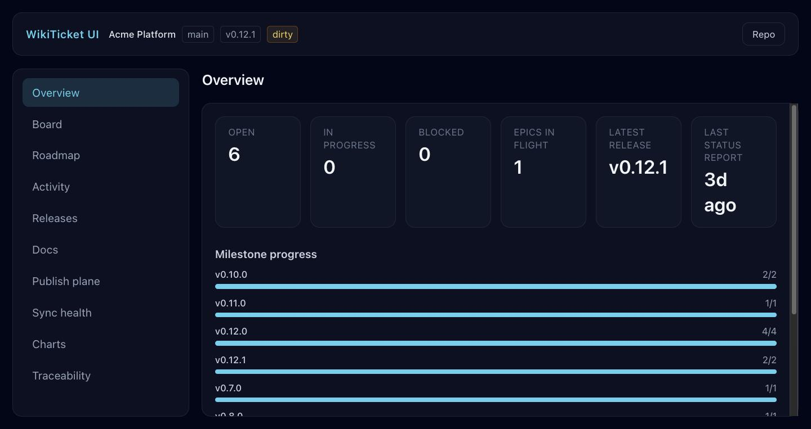
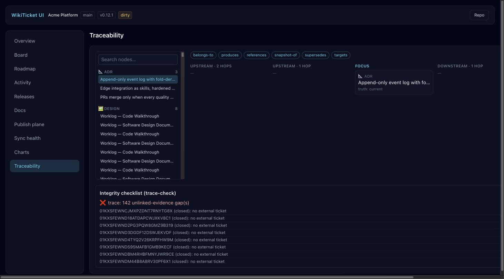
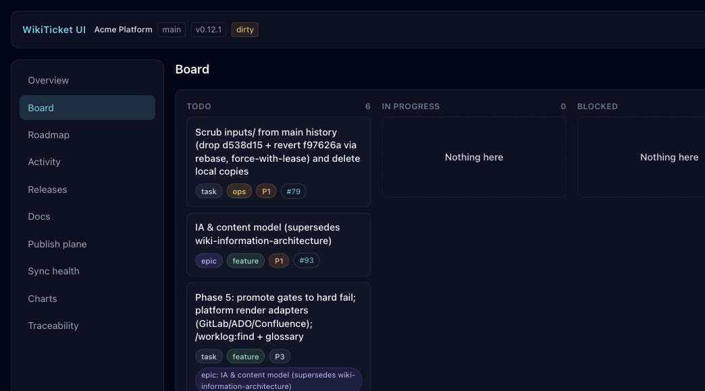

# WikiTicket UI

A local, read-only dashboard for any repository that uses
[WikiTicket SDD](https://github.com/SpillwaveSolutions/wiki_ticket_sdd)
("wicked ticket") — spec-driven development with visible WIP, tracked in a
git-native event log.

Point it at a worklog-enabled repo and see the whole project at once: kanban
board, live roadmap with Mermaid diagrams, activity feed, releases, docs
browser with truth-state badges, the wiki publish plane with drift detection,
sync health, charts, and an interactive traceability graph
(plan → item → ticket → PR → release).



Full walkthrough of both run modes: [`docs/user_guide/user-guide.md`](docs/user_guide/user-guide.md).

## Quickstart

```sh
npm install
npm run build
npm start -- --repo /path/to/your/worklog/repo
```

Open the printed URL (`http://localhost:4181` by default). That's it — one
process serves both the JSON API and the built web app.

`--repo` defaults to `$WORKLOG_REPO`, then the current directory, if omitted.
Override the port with `--port <n>` or `PORT=<n>`.

Desktop packaging, port resolution, and the test ladder: [`DESKTOP.md`](./DESKTOP.md).
Screen wireframes (PlantUML Salt): [`docs/ui/`](./docs/ui/).

## Panel tour

| Panel | What it shows |
|---|---|
| **Overview** | Open/in-progress/blocked counts, epics in flight, latest release, milestone progress bars, 30-day activity sparkline. |
| **Board** | Kanban columns (todo / in progress / blocked / recently done) with a per-item detail drawer and full event history. |
| **Roadmap** | `docs/roadmap.md` rendered live — headings, GFM tables, and Mermaid diagrams — with a table of contents. |
| **Activity** | Merged, filterable feed of worklog events, git commits, and GitHub releases, newest first. |
| **Releases** | GitHub release timeline linked to their frozen roadmap snapshots. |
| **Docs** | Inventory-driven browser (`docs/.index/_inventory.json`) with truth-state badges, search/filter, and navigable supersede chains. |
| **Publish plane** | Three-way wiki drift: in-sync, pending-republish, or source-drift (a frozen page edited after publish). |
| **Sync health** | `.work/sync-state.json` cursors, unpushed open items, and orphan/conflict alerts. |
| **Charts** | Burnup, kind mix, weekly velocity, and unplanned-work ratio, computed from the raw event log. |
| **Traceability** | Interactive `_graph.json` explorer — walk any node's evidence chain both directions — plus a trace-check integrity checklist. |





Design record: [`docs/plans/2026-07-22-wiki-ticket-ui-ia.md`](docs/plans/2026-07-22-wiki-ticket-ui-ia.md)
(pointer only — the frozen plan lives in the main repo; see `CLAUDE.md`).

## Desktop app (Tauri 2)

Same React UI, with the API ported to Rust (`src-tauri/`) and invoked over
Tauri IPC instead of HTTP. No repo selected yet? The picker opens
automatically on first launch instead of leaving every panel showing an
error. The picker has three tabs:

- **Recent** — repos you've opened before, plus a native folder dialog
  (`Choose folder…`) for anything not yet in that list.
- **Local** — scans root directories you configure (folders that hold many
  checkouts, e.g. `~/src`) for already-cloned worklog-enabled repos. Roots
  persist in `~/.config/wicked_ticket/config.json`.
- **GitHub** — browses `gh repo list` by org, filters progressively to
  worklog-enabled repos, and clones any of them with one click into a
  managed shallow-clone cache (`~/.config/wicked_ticket/clones/`), which the
  same tab lets you clear. Requires the `gh` CLI authenticated.

`WORKLOG_REPO` is still an optional seed: set it before launch and it's used
as the initial repo if valid, skipping the picker.

```sh
npm install
npm run tauri:dev     # Vite + Rust shell (dynamic port), hot reload
npm run tauri:build   # produces .app / .dmg under src-tauri/target/release/bundle/
```

`npm run test:rust` runs the Rust unit + fixture parity suite (also in CI).
The desktop shell never writes to the target repo — same read-only guarantee
as the Node server.

## Architecture

One Hono JSON API server (`server/`) plus one Vite/React/Tailwind front end
(`web/`), built as an npm workspace. Optionally wrapped by a Tauri 2 desktop
shell (`src-tauri/`) that reimplements the same 13 endpoints in Rust. The
server (or Tauri state) binds to exactly one target repo at a time and only
ever *reads* it:

- Shells out to the target's own `bin/worklog` (`fold`, `trace-check`) —
  never reimplements worklog or IA semantics.
- Reads the target's committed `docs/.index/` plane (`_inventory.json`,
  `_graph.json`, `publish-manifest.json`) directly — it's deterministic and
  byte-verbatim, no need to shell out for it.
- Reads `.work/*.jsonl`, `.work/published.json`, `.work/sync-state.json`,
  and git/`gh` for everything else, falling back to an offline state
  wherever GitHub access isn't available.

**Read-only guarantee**: this app never writes to the target repo. In
production (`npm start`), the server also serves the built `web/dist` static
assets, so one process is the whole app; in development, Vite serves the
front end and proxies `/api/*` to the server.

For how this design maps to the "graph engineering" (nodes/typed edges/index/router/
state) pattern currently being discussed for agent systems, see
[`docs/user_guide/graph-engineering.md`](docs/user_guide/graph-engineering.md).

## Development

```sh
npm install
npm run dev           # Hono API + Vite (ports auto-resolved; bases 4181 / 8080)
npm run port          # read remembered ports (does not reallocate)
npm run port:resolve  # probe free ports and write .dev-ports.json
npm run typecheck     # both workspaces
npm test              # vitest (server + web, including Tauri IPC mocks)
npm run test:e2e      # Playwright (Chromium) against a scratch fixture repo
npm run verify        # typecheck + unit + e2e — preferred pre-merge check
npm run smoke         # headless load + screenshot (dev server must already be up)
npm run test:rust     # cargo fixture parity
npm run tauri:dev     # desktop shell
```

Ports are resolved by `scripts/dev-ports.mjs` and remembered in
`.dev-ports.json` so sibling Spillwave apps do not collide. Overrides:
`WT_DEV_PORT` (Vite), `WT_API_PORT` / `PORT` / `VITE_API_PORT` (API).

Dogfood target: `../wiki_ticket_sdd`, e.g.
`npm run dev -- --repo ../wiki_ticket_sdd` or
`npm start -- --repo ../wiki_ticket_sdd`.
