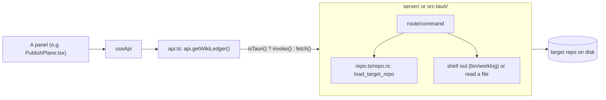

# WikiTicket UI — Code Walkthrough

The guided day-one tour: what runs first, in what order, and what to touch
(or not touch) when you change something. Companion to
`docs/designs/current_design_doc.md` — where the two disagree, this document
defers to the code and calls out the gap in §6.

## 1. Orientation

**In three sentences:** a Vite/React frontend (`web/`) renders 10
independent panels that each call one shared `api.*` object; that object
talks to a local Hono server (`server/`, browser mode) or a Tauri Rust
shell (`src-tauri/`, desktop mode) over two different transports but one
identical 13-operation contract; every operation is a read — shell out to
the target repo's own `bin/worklog`, or read one of its committed JSON
files, then join/sort/derive in a few lines of glue.

**Directory map:**

```
server/src/    app.ts (wiring), routes.ts (13 handlers), repo.ts (config +
               guard), ulid.ts (timestamp decode), index.ts (CLI entry)
server/test/   fixture.ts (shared deterministic repo), build-fixture.ts
               (CLI shim for the Rust tests), *.test.ts (one per concern)
src-tauri/src/ commands.rs (13 build_* + wrappers), repo.rs (config port),
               state.rs (AppState), error.rs (CmdError), ulid.rs, lib.rs/main.rs
src-tauri/tests/parity.rs   Rust↔Node parity oracle, reuses fixture.ts
web/src/lib/   api.ts (transport seam), types.ts (wire contract), useApi.ts
               (fetch hook), panels.ts (route table), external.ts, format.ts
web/src/panels/  one file per panel, each self-contained
web/src/components/  TopBar, SideNav, RepoPickerModal, Panel, EmptyState, ...
```

**The one diagram that explains it:**



## 2. Execution-order tour

### 2.1 Process start → first request (browser mode)

`npm start -- --repo <path>` runs `server/src/index.ts`:

```ts
// server/src/index.ts:4-23
const args = parseArgs(process.argv.slice(2));
const repoPath = args.repo || process.env.WORKLOG_REPO || process.cwd();
const port = args.port || Number(process.env.PORT) || 4181;

const app = createApp(repoPath);
serve({ fetch: app.fetch, port }, (info) => {
  console.log(`wiki-ticket-ui server on http://localhost:${info.port} (repo: ${repoPath})`);
});
```

Receives: CLI argv. Returns: nothing (starts a listening server). Can fail:
never at this point — `createApp` doesn't touch the filesystem yet, it only
resolves the path string. Why written this way: the repo path is captured
once per process; there is deliberately no runtime "switch repo" in browser
mode (§8.1 of the design doc) — restart with a different `--repo` instead.

`createApp` (`server/src/app.ts:21-54`) does the actual wiring:

```ts
// server/src/app.ts:21-37
export function createApp(repoCandidate?: string) {
  const app = new Hono<Env>();
  const repoPath = resolveRepoPath(repoCandidate);

  app.use("/api/*", async (c, next) => {
    try {
      const target = loadTargetRepo(repoPath);
      c.set("repoPath", target.repoPath);
      c.set("config", target.config);
      await next();
    } catch (err) {
      const status = err instanceof TargetRepoError ? err.status : 500;
      return c.json({ error: err instanceof Error ? err.message : String(err) }, status as 400 | 500);
    }
  });

  registerRoutes(app);
  ...
```

This is the load-bearing line: *every* `/api/*` request re-validates the
target on the way in (`loadTargetRepo` — cheap, one `fs.existsSync` +
one file read). Nothing downstream in `routes.ts` needs to check "is this a
valid repo" again — that invariant is established here (see §3).

### 2.2 A GET request through routes.ts (representative: `/api/wiki-ledger`)

```ts
// server/src/routes.ts:165-198
app.get("/api/wiki-ledger", (c) => {
  const repoPath = c.get("repoPath");
  const ledgerPath = path.join(repoPath, ".work", "published.json");
  const manifestPath = path.join(repoPath, "docs", ".index", "publish-manifest.json");
  if (!fs.existsSync(ledgerPath)) {
    return c.json({ error: "published.json not found" }, 404);
  }
  const ledger = JSON.parse(fs.readFileSync(ledgerPath, "utf8"));
  const manifest = fs.existsSync(manifestPath)
    ? JSON.parse(fs.readFileSync(manifestPath, "utf8"))
    : { pages: [] };
  const manifestByKey = new Map<string, any>(
    (manifest.pages || []).map((p: any) => [p.wiki_key, p]),
  );

  const withDrift: Record<string, any> = {};
  for (const [key, entry] of Object.entries<any>(ledger)) {
    const page = manifestByKey.get(entry.wiki_key || key);
    let drift = "unknown";
    if (page) {
      let sourceDrift = false;
      if (page.frozen && entry.source_hash && entry.source) {
        const sourcePath = path.join(repoPath, entry.source);
        if (fs.existsSync(sourcePath)) {
          const actualHash = sha256_12(fs.readFileSync(sourcePath));
          sourceDrift = actualHash !== entry.source_hash;
        }
      }
      drift = sourceDrift ? "source-drift" : page.render_hash !== entry.render_hash ? "pending" : "in-sync";
    }
    withDrift[key] = { ...entry, drift };
  }
  return c.json(withDrift);
});
```

Receives: nothing (repo path comes from context set by the middleware).
Returns: `Record<key, entry & {drift}>`. Can fail: 404 if
`.work/published.json` doesn't exist yet — a legitimate first-run state, not
an error (the frontend treats this specially, see §2.4). Why written this
way: `sourceDrift` is checked *before* falling back to the render-hash
comparison — an edited frozen source must win over the more benign "pending"
classification (see the design doc §9.1 for the full rule table). This is
the single most important piece of business logic this codebase owns
outright (everything else is closer to pass-through).

### 2.3 The identical flow in Rust (`src-tauri/src/commands.rs`)

```rust
// src-tauri/src/commands.rs:312-412 (abbreviated)
pub fn build_wiki_ledger(repo_path: &Path) -> Result<Value, CmdError> {
    let ledger_path = repo_path.join(".work").join("published.json");
    let manifest_path = repo_path.join("docs").join(".index").join("publish-manifest.json");
    if !ledger_path.exists() {
        return Err(CmdError::not_found("published.json not found"));
    }
    ...
    let drift = if let Some(page) = page {
        let mut source_drift = false;
        let frozen = page.get("frozen").and_then(|v| v.as_bool()).unwrap_or(false);
        ...
        if frozen {
            if let (Some(sh), Some(src)) = (&source_hash, &source) {
                let source_path = repo_path.join(src);
                if source_path.exists() {
                    if let Ok(bytes) = fs::read(&source_path) {
                        let actual = sha256_12(&bytes);
                        source_drift = actual != *sh;
                    }
                }
            }
        }
        if source_drift { "source-drift" } else { /* render_hash compare */ }
    } else { "unknown" };
```

Same three-tier rule, same ordering, same field names — this is not a
coincidence; it is the entire point of decision 1 in the design doc (full
Rust port, not a sidecar). The wrapper `#[tauri::command] get_wiki_ledger`
(`commands.rs:622-626`) just pulls the repo path from `AppState` via
`require_repo()` and delegates to `build_wiki_ledger`, keeping the actual
logic in a plain function that `parity.rs` can call directly without a
running Tauri app.

### 2.4 The write path — there isn't one

There is no persistent-state write path in this application. Every
operation from §2.2/§2.3 onward is read-only. The closest thing to "state"
this app itself owns is:
- `AppState.repo` (`src-tauri/src/state.rs:5-8`) — an in-memory
  `Mutex<Option<PathBuf>>` holding which target repo the desktop shell is
  currently pointed at, set by `pick_repo`/`set_repo` and read by every
  other command via `require_repo()`.
- `web/src/lib/recentRepos.ts` — a browser `localStorage` list of paths the
  operator has pointed the app at before (display convenience only, never
  read by the backend).

### 2.5 Automation path: CI (`.github/workflows/ci.yml`)

Two jobs run on every push/PR to `main`: `build` (Node typecheck + build +
`npm test` across both workspaces) and `rust` (`npm ci` — needed because the
Rust tests shell out to `npx tsx server/test/build-fixture.ts` for their
fixture — then `cargo test --manifest-path src-tauri/Cargo.toml`). This is
the automated proof that decision 1 (parity between backends) actually
holds on every commit, not just at the time the port was written.

## 3. Load-bearing invariants

- **Every `/api/*` request re-validates the target repo before any handler
  runs.** Enforced in `server/src/app.ts:27-37` (the middleware) and
  equivalently by `require_repo()` at the top of every Tauri command
  (`src-tauri/src/commands.rs:60-68`). If violated (a handler bypassed the
  check), a stale or invalid repo path could be read from — every current
  handler goes through this, so the invariant currently holds by
  construction, not by a runtime assertion.
- **`resolveDocPath`/`resolve_doc_path` is the only path between
  user-controlled input and a filesystem read.** Enforced at
  `server/src/repo.ts:100-109` / `src-tauri/src/repo.rs:146-170`. If
  violated, an operator could read arbitrary files outside `docs/` on their
  own machine via `?path=../../../../etc/passwd`-style input. Tested
  explicitly for both a relative (`docs/../.work/config.yml`) and, in Rust,
  an absolute (`/etc/passwd`) traversal attempt.
- **`ApiError.status` must survive the Tauri transport unchanged.** Enforced
  by `toApiError()` (`web/src/lib/api.ts:37-74`), which reconstructs
  `ApiError(message, status)` from either an object or a stringified-JSON
  rejection payload. If violated, four panels (`Docs`, `Traceability`,
  `PublishPlane`, `SyncHealth`) would render `ErrorState` instead of
  `EmptyState` for a plain "hasn't run yet" 404 under Tauri — a UX
  regression, not a crash, but silent and easy to miss without the parity
  tests.
- **The `.work/todo.jsonl`/`done.jsonl` trailing-newline + append-only
  convention** is enforced by the *target repo's own* pre-commit hook, not
  by this codebase (`readJsonlEvents`/`read_jsonl_events` trust it and
  simply skip blank lines). If violated in a target repo, event parsing
  degrades gracefully (blank/unparseable lines are filtered, not crashed
  on) but that repo's own hook is the real guard.
- **`sha256_12` truncation (first 12 hex chars of a SHA-256) must match
  between Node (`server/src/routes.ts:12-14`) and Rust
  (`src-tauri/src/commands.rs:29-34`).** If it didn't, drift computation
  (§2.2/§2.3) would disagree between backends on identical input — this is
  exactly the class of bug the fixture parity suite exists to catch.

## 4. Tests as executable specification

**`server/test/wiki-ledger.test.ts`** proves the three-state drift rule
end-to-end through the real HTTP route:

```ts
// server/test/wiki-ledger.test.ts:6-27
it("classifies all three drift states", async () => {
  const dir = buildFixtureRepo();
  const app = createApp(dir);
  const res = await app.request("/api/wiki-ledger");
  expect(res.status).toBe(200);
  const ledger = await res.json();

  expect(ledger["adr/0001-test"].drift).toBe("in-sync");
  expect(ledger["roadmap"].drift).toBe("pending");
  expect(ledger["guide/pending-doc"].drift).toBe("source-drift");
  expect(ledger["adr/0001-test"].url).toBe("https://github.com/acme/fixture-repo/wiki/ADR-0001-test");
});
```

Rule it proves: the drift classification (§2.2) is correct for all three
cases simultaneously, from one fixture, through the actual Hono app (not a
unit-tested helper in isolation) — a regression here would mean the whole
Publish Plane panel misreports drift state to the operator. Regression it
would catch: any reordering of the `source-drift`/`pending` check (§2.2's
"why written this way" note), or a broken hash computation.

**`src-tauri/tests/parity.rs::wiki_ledger_three_drift_states`** proves the
identical rule holds in Rust, against the *same* fixture:

```rust
// src-tauri/tests/parity.rs:128-139
#[test]
fn wiki_ledger_three_drift_states() {
    let dir = fresh_fixture();
    let ledger = build_wiki_ledger(&dir).expect("ledger");
    assert_eq!(ledger["adr/0001-test"]["drift"], "in-sync");
    assert_eq!(ledger["roadmap"]["drift"], "pending");
    assert_eq!(ledger["guide/pending-doc"]["drift"], "source-drift");
    assert_eq!(
        ledger["adr/0001-test"]["url"],
        "https://github.com/acme/fixture-repo/wiki/ADR-0001-test"
    );
}
```

`fresh_fixture()` (`parity.rs:21-36`) shells out to `npx tsx
server/test/build-fixture.ts` for a live temp-dir fixture — the Rust suite
does not maintain its own duplicate fixture data. Regression it would
catch: exactly the Node/Rust drift risk named in the design doc's top risk
(§31 there) — if either implementation's drift logic changes without the
other, this test (or its Node twin) fails.

**`src-tauri/src/repo.rs` traversal tests** (lines 270-283) prove the
security-relevant guard in isolation:

```rust
#[test]
fn resolve_doc_path_blocks_traversal() {
    let repo = PathBuf::from("/tmp/some-repo");
    let err = resolve_doc_path(&repo, "docs/../.work/config.yml").unwrap_err();
    assert_eq!(err.status, 400);
    assert!(err.message.contains("escapes docs"));
}
```

Rule it proves: a `..`-based escape from `docs/` is rejected with a 400
before any file read is attempted. Regression it would catch: someone
"simplifying" the guard to a plain `startsWith("docs")`-style string check
(which a sibling directory like `docs-evil/` would defeat) instead of the
normalized-path-plus-separator check actually used.

**`server/test/events.test.ts`** (referenced, not shown in full) proves the
ULID timestamp decode against the spec's own test vector — the anchor for
`ulid.ts`/`ulid.rs` byte-for-byte parity, called out explicitly in the Tauri
plan as a place where an *outdated comment* in `fixture.ts` cites a
different example and must not be trusted over the real test assertion.

Not listed exhaustively: `docs.test.ts`, `items.test.ts`, `releases.test.ts`,
`repo.test.ts` each cover one route/module in the same fixture-driven style;
they're straightforward pass-through/derive checks and don't carry the same
density of business rule as the four highlighted above.

## 5. Junior engineer orientation

**The five most important things to internalize:**
1. This app never computes worklog truth itself — if a number looks wrong,
   check whether it came from `bin/worklog fold`/`trace-check` (external,
   not this repo's bug) or from client-side derivation (`Board.tsx`,
   `Charts.tsx`, `Overview.tsx` — this repo's bug, if any).
2. Every backend operation exists twice (Node + Rust) and must stay
   field-identical — always update both, and re-run `parity.rs` after
   touching either.
3. `web/src/lib/api.ts` is the *only* file that knows about `fetch` vs
   `invoke` — a panel should never need to branch on `isTauri()` itself.
4. A 404 is not always an error in this app — check whether the panel
   you're touching is one of the four (`Docs`, `Traceability`,
   `PublishPlane`, `SyncHealth`) that render an empty state for it.
5. `docs/.index/*.json` and `.work/*.jsonl` are read, never written, by
   this codebase — if you find yourself writing to either, you've
   violated the read-only guarantee; stop and re-check the plan.

**Where to start debugging:** the server's one startup log line tells you
which repo path it actually resolved to — a wrong-repo bug is almost always
a `--repo`/`WORKLOG_REPO`/cwd resolution issue (`server/src/repo.ts:82-84`),
check that before assuming a route bug.

**Where common changes are made:** adding a panel = one entry in
`web/src/lib/panels.ts` + one file in `web/src/panels/`. Adding a backend
field = update `web/src/lib/types.ts` first (the contract), then both
`routes.ts` and `commands.rs` to match it, then the fixture + both test
suites.

**Files risky to modify:** `server/src/repo.ts` / `src-tauri/src/repo.rs` —
touching the flat-YAML parser or the doc-path guard without updating both
languages (and both test files) is exactly how the two backends drift.
`web/src/lib/api.ts`'s `toApiError` — a subtle change here silently breaks
the four panels' 404-as-empty-state behavior only under Tauri, which is easy
to miss if you only test in browser mode.

**Invariants that must never be broken:** the four listed in §3 — repo
validation on every request, the doc-path traversal guard, `ApiError.status`
transport parity, and the source-drift-before-pending check ordering.

## 6. Gaps and design drift

- **No design-doc claim contradicts the code** as of this walkthrough —
  the design doc (`current_design_doc.md`) was generated against the same
  commit and cross-checked against the same source files.
- **Missing automated enforcement of the read-only guarantee** (also
  flagged in the design doc §22/§31): the grep-based review gate
  (`rg 'fs::write|fs::remove_|Command::new\("(git|gh)"'`) is documented in
  `docs/plans/2026-07-23-tauri-desktop-shell.md` as a manual step, not a CI
  job. This is a real gap between stated intent ("verified") and actual CI
  coverage — worth closing (see design doc §32 item 1).
- **Unused/dead code:** none identified — the codebase is small and every
  file read during this walkthrough is reachable from either `App.tsx`'s
  route table or a `#[tauri::command]` registration in `lib.rs`.
- **Duplicated logic, by design, not by accident:** `server/src/repo.ts` and
  `src-tauri/src/repo.rs` are intentionally line-for-line duplicates (see
  design doc §6 decision 2) — this is not the kind of duplication to
  refactor away; doing so (e.g. via FFI or a shared native module) would
  reintroduce exactly the cross-language dependency the port was designed
  to avoid.
- **Missing tests:** no automated test asserts the `rg` read-only grep gate
  itself — it is currently a documented manual step (see above), which
  means it is also, by definition, untested.
- **Unclear ownership:** the orphaned worklog event `01KY5ZZX` mentioned in
  `docs/plans/2026-07-23-tauri-desktop-shell.md`'s context section is target
  repo data, not code in this repository, but it is visible confusion in
  this repo's own Sync Health panel when dogfooding — flagged there, not a
  code defect here.
