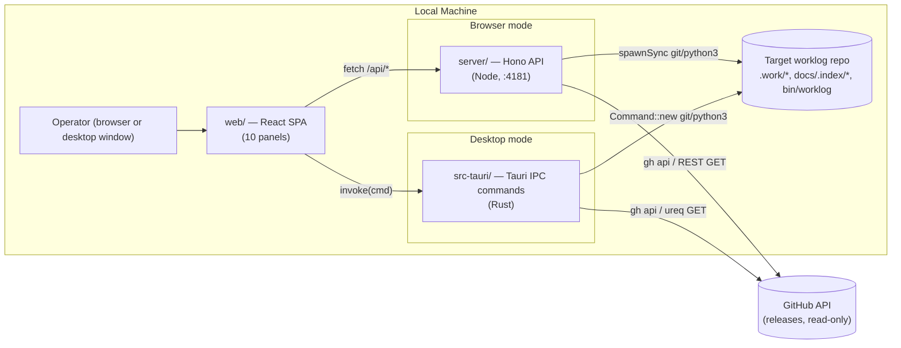
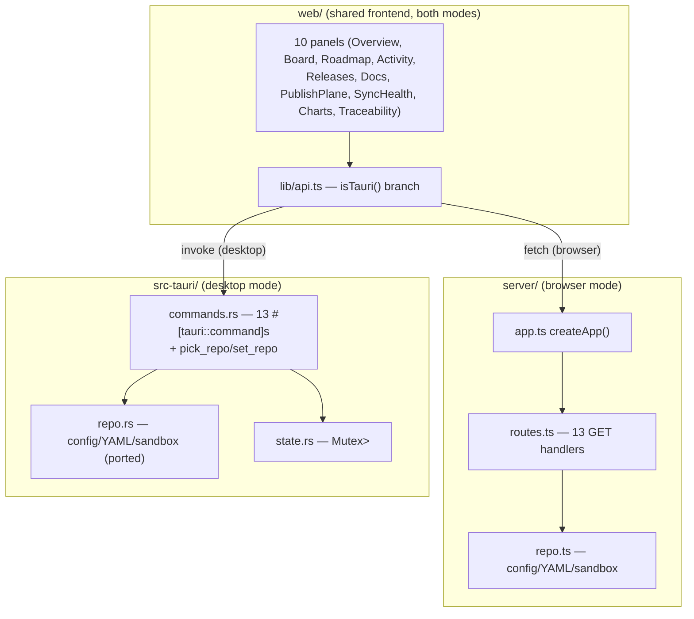
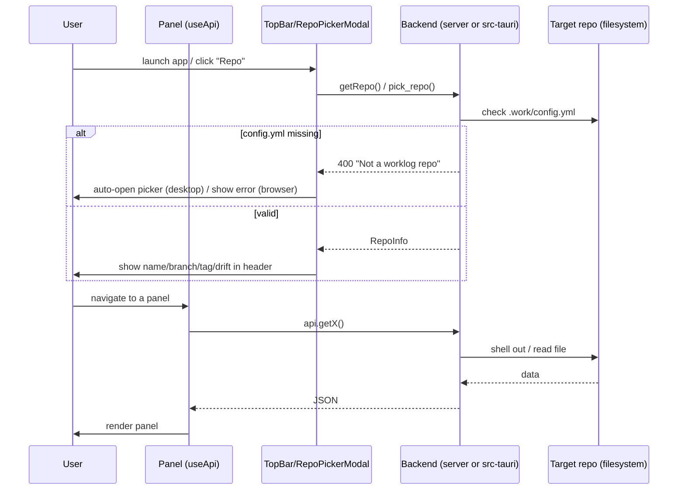
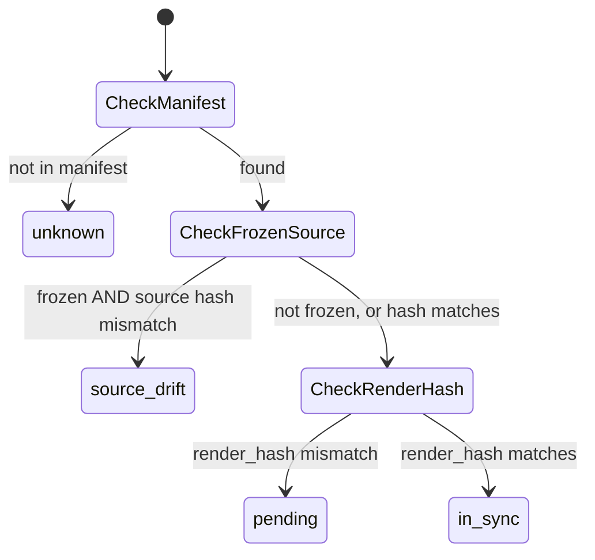
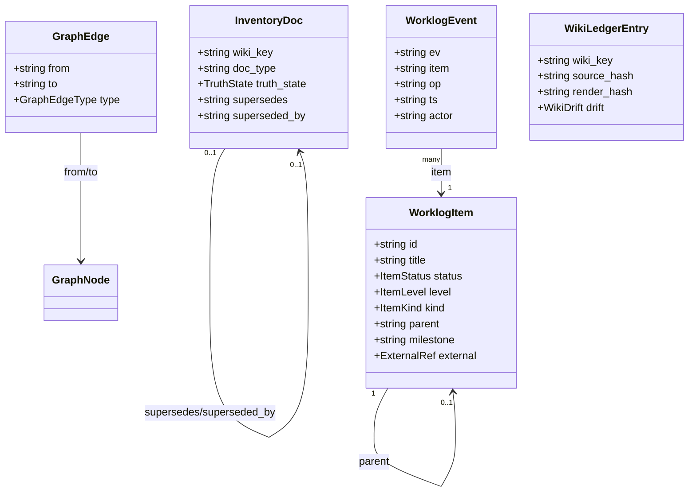
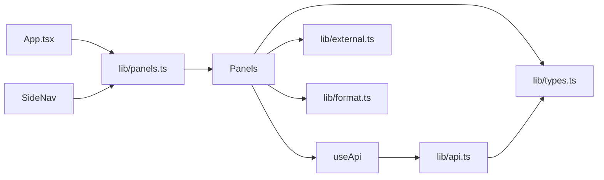
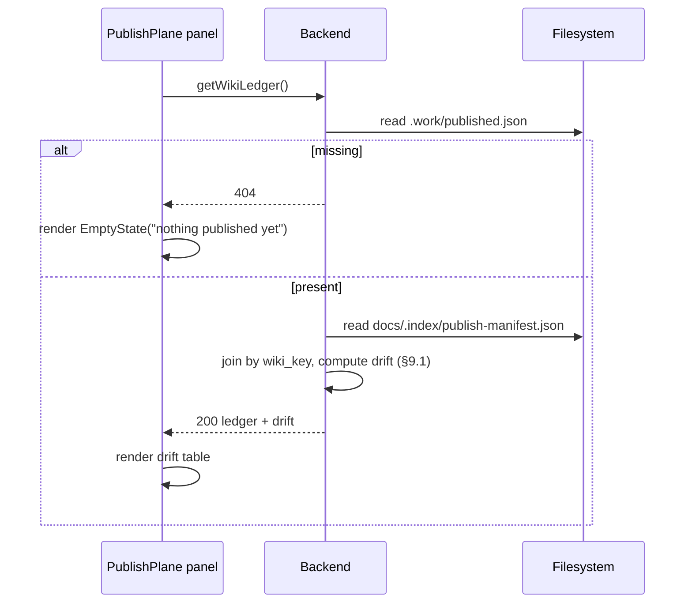
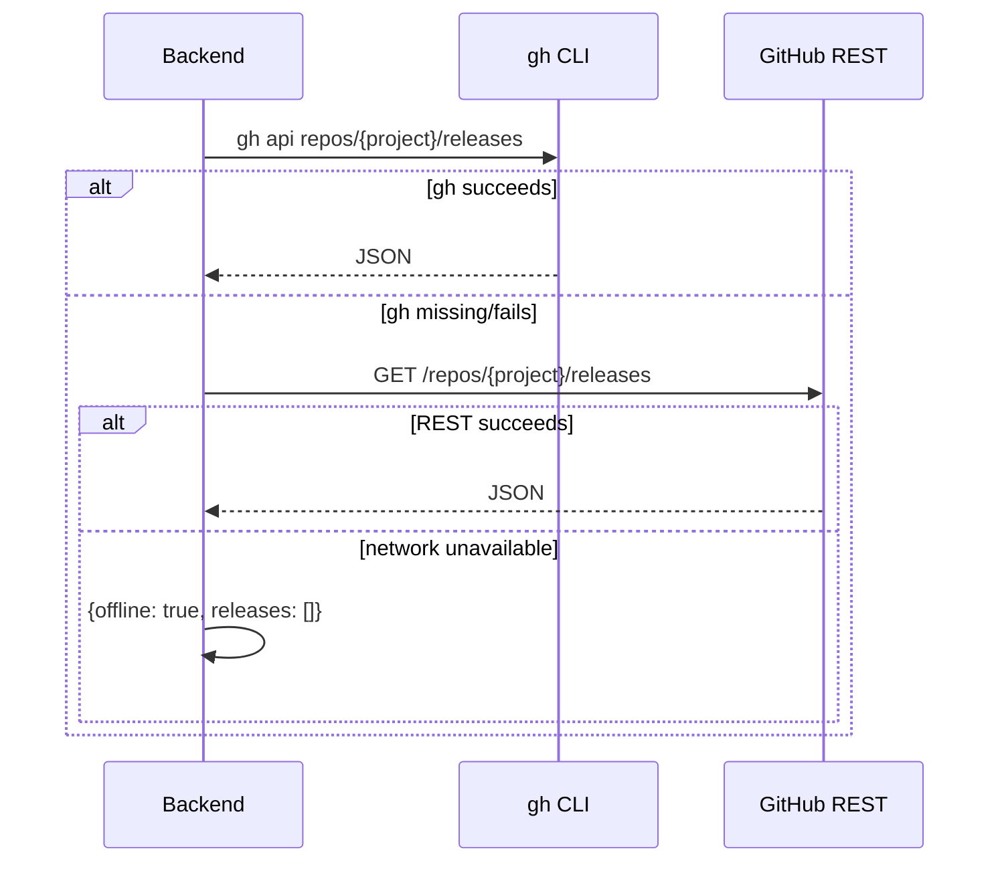
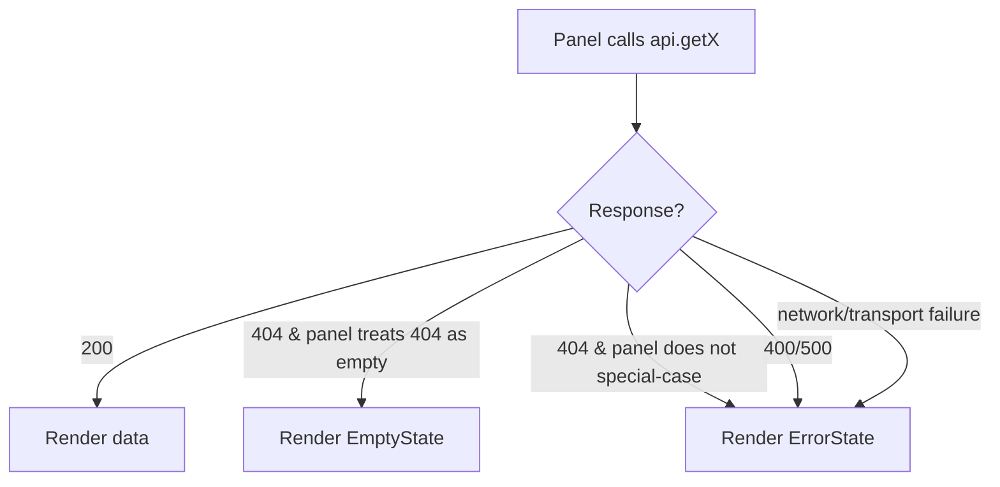
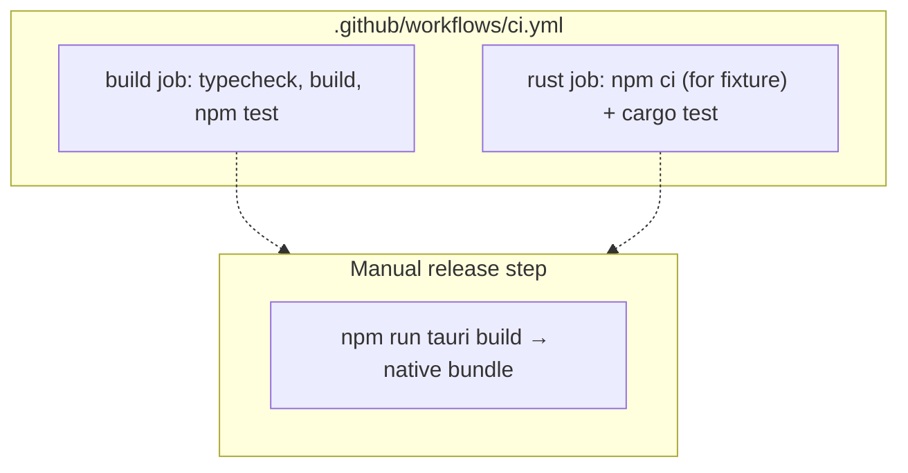

# WikiTicket UI — Software Design Document

## 1. Document Overview

**Purpose.** Explain what WikiTicket UI is, why it is built the way it is, and
how its two parallel backends (a Node/Hono HTTP API and a Tauri 2/Rust IPC
layer) stay in lockstep behind one React frontend.

**Intended audience.** Junior developers extending a panel or a backend
command; anyone assessing scope, risk, or extension points before proposing a
change.

**Scope.** The three source trees that ship in this repository at tag
`v0.2.0`: `server/` (Hono JSON API + static host), `web/` (Vite/React/Tailwind
frontend, ten panels), `src-tauri/` (Tauri 2 desktop shell, a full Rust port
of the same 13 endpoints). Also in scope: `bin/worklog` as the external
contract this app shells out to, and the `docs/.index/` plane it reads.

**Out of scope.** The internals of `bin/worklog` itself, the WikiTicket SDD
worklog spec, and the target repository's own content — this document
describes the *viewer*, not the thing it views. Those live in the governing
plan (`docs/plans/2026-07-22-wiki-ticket-ui-ia.md`, frozen, pointer only) and
in the upstream `wiki_ticket_sdd` repo per this repo's `CLAUDE.md`.

**Related documents.**
- `docs/plans/2026-07-21-wiki-ticket-ui.md` — original panel-by-panel plan
- `docs/plans/2026-07-22-wiki-ticket-ui-ia.md` — IA-aware supersession (frozen governing plan)
- `docs/plans/2026-07-23-tauri-desktop-shell.md` — the Tauri port plan (source of most of §6)
- `README.md` — user-facing quickstart and panel tour
- `CLAUDE.md` — non-negotiable design rules referenced throughout this document

**Definitions and acronyms.**
- **IA** — Information Architecture: the `docs/.index/` plane (`_inventory.json`,
  `_graph.json`, `publish-manifest.json`) that classifies and links every
  tracked document.
- **ULID** — Universally Unique Lexicographically Sortable Identifier; its
  first 10 characters encode a 48-bit millisecond timestamp.
- **Target repo** — the arbitrary WikiTicket SDD repo this app points at
  (`--repo`, `WORKLOG_REPO`, or the Tauri folder picker); never this repo itself.
- **Drift** — a computed relationship between what is published to the wiki
  and what the source currently says (`in-sync` / `pending` / `source-drift` / `unknown`).

**Assumptions.** The target repo has already run `worklog init` (has
`.work/config.yml`, `bin/worklog`) — this app never scaffolds one. `python3`,
`git`, and optionally `gh` are on `PATH` in the target repo's environment.

**Open questions.** See §34.

## 2. Executive Summary

WikiTicket UI is a **read-only observability dashboard** for any repository
that has adopted WikiTicket SDD — a spec-driven development methodology that
tracks work as a git-native JSONL event log (`.work/todo.jsonl`,
`.work/done.jsonl`) instead of a hosted project-management tool. Teams using
that methodology have all their process data as plain files in git, but no
single visual surface to see it. This app is that surface: kanban board,
live roadmap (with Mermaid diagrams), activity feed, releases, a
document-inventory browser, wiki publish-drift detection, sync health, burn
charts, and an interactive traceability graph — ten panels, one process.

It ships two ways: as a **local web app** (`npm start -- --repo <path>`, one
Node process serves both the JSON API and the built frontend) and as a
**native desktop app** (Tauri 2, same React UI, same 13 read operations
reimplemented in Rust and invoked over IPC instead of HTTP, with a native
folder-picker for choosing the target repo). Both share the identical
`web/` frontend unchanged — the only thing that differs is the transport
`web/src/lib/api.ts` uses underneath one unified `api.*` surface.

**Key architectural decision:** this app never reimplements WikiTicket SDD's
own semantics. It shells out to the target repo's own `bin/worklog` (`fold`,
`trace-check`) for anything derived, and reads the target's own committed
`docs/.index/` JSON files byte-verbatim for anything structural. It never
parses `.work/*.jsonl` business rules itself beyond trivial sort/derive
steps documented in this file. This keeps the app perpetually correct as the
worklog spec evolves, at the cost of depending on `python3` + the target's
`bin/worklog` script being present and runnable.

**Primary risks:** (1) the Rust and Node backends can drift apart silently
if either is changed without the other — mitigated by a shared fixture-based
parity test suite (§28); (2) every endpoint that shells out depends on
external binaries (`git`, `gh`, `python3`) being on `PATH` in the runtime
environment; (3) the hand-rolled flat-YAML parser (duplicated in TS and
Rust) will silently misparse any `.work/config.yml` that uses YAML features
beyond two-level flat scalars — deliberate, but a real constraint.

## 3. Requirements Summary

**Functional.**
- Read and render 10 categories of target-repo state (items, events, roadmap,
  docs inventory, traceability graph, publish manifest, wiki ledger,
  sync state, git log, GitHub releases) — one panel each.
- Support any WikiTicket SDD repo, chosen at runtime, not baked in.
- Run identically as a browser app and as a native desktop app.

**Non-functional / operational.**
- **Read-only guarantee**: never write to the target repo (CLAUDE.md rule 3).
  Verified structurally — no route/command in `server/src/routes.ts` or
  `src-tauri/src/commands.rs` calls a mutating `git`/`gh`/`fs` operation
  against the target repo; the desktop shell's own acceptance check runs
  `git status --porcelain` on the dogfood repo before/after a full session
  (`docs/plans/2026-07-23-tauri-desktop-shell.md` §6 step 13).
- **Generic by construction**: no hardcoded repo path, name, or GitHub
  coordinate anywhere; every identity fact is derived from the target's own
  `.work/config.yml` and git remotes (CLAUDE.md rule 1).
- **Degrade gracefully**: `gh` CLI when available → unauthenticated REST
  fallback → full offline function (CLAUDE.md rule 4) — implemented
  identically in both backends for `/api/releases` / `get_releases`.
- **Security**: a path-traversal guard on doc-content reads (`resolveDocPath`
  / `resolve_doc_path`) confines every read to the target's `docs/` subtree.

**Traceability (requirement → component).**

| Requirement | Component |
|---|---|
| Read-only guarantee | `server/src/routes.ts` (`run()` uses only read subcommands); `src-tauri/src/commands.rs` (`run()`, same) |
| Generic by construction | `server/src/repo.ts` (`resolveRepoPath`, `loadTargetRepo`); `src-tauri/src/repo.rs` (same) |
| Never reimplement worklog/IA semantics | `/api/items` and `/api/trace-check` shell to `bin/worklog`; `/api/docs`, `/api/index/graph`, `/api/index/manifest` are byte-verbatim file reads |
| Degrade gracefully | `/api/releases` (`registerRoutes`, `build_releases`) — gh → ureq/fetch → offline chain |
| Path-traversal safety | `resolveDocPath` (`server/src/repo.ts:100-109`), `resolve_doc_path` (`src-tauri/src/repo.rs:146-170`) |
| Parity between backends | `src-tauri/tests/parity.rs`, sharing `server/test/fixture.ts` via `server/test/build-fixture.ts` |

## 4. System Context

**Actors.** A single human operator running the app locally against one
worklog-enabled repository at a time. No multi-tenant or multi-user concept.

**External systems.**
- **Target repo's filesystem** — `.work/*.jsonl`, `.work/config.yml`,
  `.work/published.json`, `.work/sync-state.json`, `docs/.index/*.json`,
  `docs/roadmap.md`, arbitrary `docs/**/*.md` (read through the doc-path guard).
- **Target repo's `bin/worklog` CLI** — shelled out to for `fold` and
  `trace-check`; the sole place worklog *business logic* is evaluated.
- **git** (in the target repo) — branch, latest tag, dirty status, commit log.
- **GitHub** — releases, via `gh api` when the CLI is present and
  authenticated, else an unauthenticated `GET /repos/{project}/releases` REST
  call, else treated as offline. Read-only (`GET` only, never used to write).

**Trust boundary.** The browser/webview (untrusted relative to the local
filesystem) talks only to the local Node/Hono process (browser mode) or the
Tauri IPC bridge (desktop mode); both live on the same machine as the target
repo. There is no network-facing deployment — this is a local developer
tool, not a hosted service.



Purpose: shows the two interchangeable transports converging on the same
target repo and the same external GitHub read path. Failure behavior: if
`Target` is missing `.work/config.yml`, both backends reject with a 400
before touching anything else (`loadTargetRepo`/`load_target_repo`); if `GH`
is unreachable, `/api/releases` degrades to `{offline: true}` rather than
erroring.

## 5. High-Level Architecture

Three workspaces, one contract:

- **`web/`** — Vite + React 18 + TypeScript + Tailwind + react-router. Ten
  route-mapped panels (`web/src/lib/panels.ts`), each independently fetching
  its own data via `useApi()` (a small loading/error/data hook,
  `web/src/lib/useApi.ts:13-44`). All network access funnels through
  `web/src/lib/api.ts`'s single `api` object — no panel calls `fetch` or
  `invoke` directly.
- **`server/`** — Hono app (`server/src/app.ts`) bound to exactly one target
  repo path at process start. 13 GET routes (`server/src/routes.ts`), each a
  thin `spawnSync` shell-out or a raw file read. Serves `web/dist` in
  production so one process is the whole app.
- **`src-tauri/`** — Tauri 2 Rust shell. Same 13 operations as
  `#[tauri::command]`s (`src-tauri/src/commands.rs`), invoked over Tauri's
  IPC bridge instead of HTTP. Adds two desktop-only commands (`pick_repo`,
  `set_repo`) backed by a native folder dialog, because the desktop app has
  no meaningful cwd and no `--repo` flag to relaunch with.



Purpose: the frontend is architecturally unaware of which backend answers
it — `isTauri()` (`web/src/lib/api.ts:34-35`) is the only branch point.
Related modules: `web/src/lib/types.ts` is the wire contract both backends
independently satisfy (deliberately not codegen'd — see ADR-1 in §6).

**Deployment.** Both modes are single-machine, single-process (per mode),
no containers, no orchestration. Browser mode: `npm run build && npm start
-- --repo <path>` (Node ≥ hono/node-server). Desktop mode: `npm run tauri
build` produces a native bundle (`.app`/`.dmg` on macOS) under
`src-tauri/target/release/bundle/`. See §27.

## 6. Architectural Decisions

**Decision 1 — Full Rust port of the API, not a Node sidecar, for the
desktop shell.** *Context:* the frozen IA plan already stated the API layer
should be "swappable for Tauri's Rust side without touching the UI."
*Alternatives considered:* bundle the existing Node server as a sidecar
process inside the Tauri bundle. *Selected:* a line-for-line Rust port of
all 13 handlers (`docs/plans/2026-07-23-tauri-desktop-shell.md`).
*Rationale:* avoids bundling and lifecycle-managing an entire Node runtime
inside a desktop app; keeps the "read-only" guarantee auditable in one
language per surface. *Tradeoff:* two implementations of every endpoint to
keep in sync — accepted, and mitigated by a shared fixture parity suite
(§28). *Revisit if:* the two backends drift in practice despite the parity
suite, or a third transport (e.g. a mobile shell) is added, at which point a
shared IDL/codegen tradeoff should be re-evaluated.

**Decision 2 — Hand-rolled flat-YAML parser, not a YAML library, in both
languages.** *Context:* `.work/config.yml` is deliberately a flat, two-level
subset (`server/src/repo.ts:46-51`; ported unchanged into
`src-tauri/src/repo.rs:60-63`). *Alternatives:* a real YAML crate/library in
each language. *Selected:* a ~30-line hand-rolled parser, duplicated
line-for-line in TS and Rust. *Rationale:* (a) the target's config really is
flat by convention, so a full parser is unneeded machinery; (b) a real
parser in each language could interpret edge cases differently — the exact
Rust/Node drift this port exists to avoid; (c) `serde_yaml` (the natural
Rust choice) is unmaintained upstream. *Tradeoff:* any `.work/config.yml`
that legitimately needs deeper YAML (lists, block scalars, more than two
levels) will silently misparse — accepted as a known ceiling
(**ponytail: hand-rolled two-level YAML parser, ceiling = config never
needs lists/deep nesting; move to a real parser only if that assumption
breaks**).

**Decision 3 — Never reimplement `bin/worklog`'s business rules.**
*Context:* CLAUDE.md rule 2. *Alternatives:* re-derive item status, taxonomy
validation, or trace linkage in TypeScript/Rust for speed (no subprocess
spawn). *Selected:* shell out to `bin/worklog fold` / `trace-check` for
anything the worklog spec defines, and read `docs/.index/*.json` verbatim
for anything the IA tooling already computed. *Rationale:* the worklog
taxonomy (`docs/plans/2026-07-18-work-taxonomy.md`, in the target repo) is
versioned per-repo; re-deriving it here would fork semantics from the
target's own `bin/worklog` version. *Tradeoff:* every load of `/api/items`
pays a Python subprocess spawn; acceptable for a local single-operator tool.

**Decision 4 — No shared-types codegen between TypeScript and Rust.**
*Context:* 13 response shapes must match exactly across two languages.
*Alternatives:* a schema/codegen pipeline (e.g. generate both from one IDL).
*Selected:* `web/src/lib/types.ts` is the one hand-kept contract; both
backends satisfy it independently, verified by the fixture-driven parity
tests. *Rationale:* 13 rarely-changing response shapes don't justify a
codegen toolchain (`docs/plans/2026-07-23-tauri-desktop-shell.md` §"CLAUDE.md
rules" item 5). *Revisit if:* the type surface grows much larger or changes
frequently enough that manual sync becomes error-prone in practice.

**Decision 5 — Client-side transport branch, not two frontends.**
*Context:* need one UI to work over both HTTP and Tauri IPC.
*Alternatives:* maintain two frontend builds, or an abstraction layer with
its own plugin system. *Selected:* a single `isTauri()` boolean check inside
`getJson`/`getText` (`web/src/lib/api.ts:76-109`); every panel keeps calling
`api.getX()` unchanged. *Rationale:* zero component-level changes required
for the entire Tauri port. *Consequence:* `ApiError.status` must round-trip
identically through both transports — `toApiError()`
(`web/src/lib/api.ts:37-74`) exists specifically to reconstruct it from
Tauri's serialized `CmdError` rejection payload, because four panels
(`PublishPlane`, `SyncHealth`, `Docs`, `Traceability`) branch on
`status === 404` to render empty states instead of errors.

## 7. Component Inventory

| Component | Type | Responsibility | Inputs | Outputs | Depends on | Failure impact |
|---|---|---|---|---|---|---|
| `web/` SPA | Frontend | Render 10 panels, route, own loading/error/data state per panel | `/api/*` JSON or `invoke()` results | Rendered UI | `lib/api.ts` | A panel's own fetch failing only affects that panel — panels are independent |
| `server/` Hono API | Backend (browser mode) | Bind one target repo, expose 13 GET routes, serve built frontend | HTTP GET | JSON / text / static assets | Target repo files, `bin/worklog`, `git`, `gh` | Whole browser-mode app down if the process isn't running |
| `src-tauri/` Tauri shell | Backend (desktop mode) | Same 13 reads + repo picker, over IPC | Tauri `invoke()` | Serialized JSON / structs | Same as above, plus `tauri-plugin-dialog` | Whole desktop app down if the binary crashes |
| `server/src/repo.ts` / `src-tauri/src/repo.rs` | Shared logic (per-language) | Validate `.work/config.yml`, parse it, guard doc-path traversal | Repo path, requested doc path | `WorklogConfig`, validated path | Filesystem only | A malformed config rejects the whole target with a clear 400, not a crash |
| `bin/worklog` (external, in target repo) | External CLI | Compute folded item state, trace-check integrity report | `.work/*.jsonl` | JSON (`fold`), text (`trace-check`) | Target repo's own Python environment | `/api/items`/`get_items` and `/api/trace-check`/`get_trace_check` 500 if this fails |
| `docs/.index/*.json` (in target repo) | External data plane | Pre-computed document inventory, graph, publish manifest | Committed by the target's own `worklog ia-index`/`ia-render` | Read byte-verbatim | N/A (file read) | Missing file → clean 404, panels show an empty state, not an error |
| GitHub REST/`gh` | External service | Release list | `ticketing.project` from config | JSON release array | Network / `gh` auth | Falls back through 3 tiers to `{offline: true, releases: []}` |

## 8. End-to-End Workflows

### 8.1 Choosing a target repo and loading the app

**Browser mode.** Trigger: `npm start -- --repo <path>` (or `WORKLOG_REPO`
env, or cwd as last resort — `server/src/repo.ts:82-84`). The server binds
to exactly one repo for its whole process lifetime; there is no "switch
repo" endpoint. `RepoPickerModal` in browser mode only remembers paths in
`localStorage` for the *next* launch (`web/src/components/RepoPickerModal.tsx:37-49`);
it cannot switch repos live.

**Desktop mode.** Trigger: app launch with `AppState.repo` starting `None`
unless `WORKLOG_REPO` validates at startup (`src-tauri/src/lib.rs:12-17`).
`TopBar` auto-opens the picker on first load if `get_repo` fails with
"no repo selected" (`web/src/components/TopBar.tsx:13-20`). The user picks a
folder via the native dialog (`pick_repo`) or re-selects a remembered path
(`set_repo`); both funnel through `apply_repo_path()`
(`src-tauri/src/commands.rs:523-534`), which validates via
`load_target_repo` *before* storing the path, then the frontend does
`window.location.reload()` to remount every panel's `useApi(fetcher, [])`
against the new repo.



Failure flow: a config-missing rejection never crashes the process — every
route/command returns a typed error (`TargetRepoError`/`CmdError`) the
frontend can render. No retries, no idempotency concerns (pure reads).

### 8.2 Publish-drift detection (Publish plane panel)

Trigger: navigating to `/publish-plane`. Preconditions: none (a missing
`.work/published.json` is a valid, expected state — first-run). Main flow:
`build_wiki_ledger`/`/api/wiki-ledger` reads `.work/published.json` (what
was last pushed to the wiki) and `docs/.index/publish-manifest.json` (what
the source currently renders to), joins them by `wiki_key`, and computes one
of three drift states per page (`server/src/routes.ts:180-197`,
`src-tauri/src/commands.rs:312-412` — see §9 for the full rule).

### 8.3 Traceability graph exploration

Trigger: navigating to `/traceability`. Loads `_graph.json`
(`GET /api/index/graph`) and runs `bin/worklog trace-check`
(`GET /api/trace-check`) in parallel. The panel does client-side breadth-
first neighborhood computation (`computeNeighborhood`, up to 2 hops each
direction) and parses the trace-check text output into a gap list
(`parseTraceCheck`) — both pure functions in
`web/src/panels/traceability-graph.ts`, unit-tested independent of
rendering. Deep-linkable via `?node=<id>` (`web/src/panels/Traceability.tsx:141-148`).

## 9. Complex Business Logic

### 9.1 Three-state wiki publish drift

**Plain language:** a wiki page can be in one of three states relative to
its source: it matches what's published (fine), its rendered content
changed but the underlying source file didn't (safe to auto-republish), or
— the dangerous case — a *frozen* page's source file was edited after it
was published (an integrity violation; a human must reconcile it, because
republishing alone can't tell which version is "true").

**Rule** (`server/src/routes.ts:180-197`, ported identically at
`src-tauri/src/commands.rs:364-405`):

| Condition | Result |
|---|---|
| Page not found in manifest at all | `unknown` |
| Manifest page is `frozen: true` **and** the source file's current sha256-12 hash ≠ the ledger's recorded `source_hash` | `source-drift` |
| Otherwise, ledger's `render_hash` ≠ manifest's `render_hash` | `pending` |
| Otherwise | `in-sync` |

Note the ordering: `source-drift` is checked (and wins) *before* `pending` —
an edited frozen source is reported as the integrity violation it is, not
merged into the more benign "pending republish" bucket. Verified for all
three states by `server/test/wiki-ledger.test.ts` against
`server/test/fixture.ts`'s three purpose-built ledger entries, and by
`src-tauri/tests/parity.rs::wiki_ledger_three_drift_states` against the same
fixture via the Rust command function directly.



### 9.2 ULID-derived event timestamps

**Plain language:** every worklog event has an `ev` ID that is a ULID, whose
first 10 characters encode the creation time even if the event's own `ts`
field is absent (legacy events, or events written before the `ts` field
existed). `GET /api/events` fills in a missing `ts` from that ID so the
Activity feed and Board's "recently done" bucket can always sort
chronologically.

**Rule** (`server/src/ulid.ts:5-19`, ported at `src-tauri/src/ulid.rs`):
decode the first 10 Crockford-base32 characters as a base-32 big-endian
integer → epoch milliseconds → ISO string. Byte-for-byte parity verified
against the ULID spec's own test vector
(`01ARZ3NDEKTSV4RRFFQ69G5FAV` → `2016-07-30T23:54:10.259Z`, per
`server/test/events.test.ts` and mirrored in
`src-tauri/tests/parity.rs::events_derive_ts_and_sort_desc`).

### 9.3 Board column bucketing ("recently done" window)

**Rule** (`web/src/panels/Board.tsx:27-57`): an item is "recently done" if
its most recent `close` event happened within the last 14 days; if *no*
done item qualifies (a quiet repo), the column instead falls back to the 20
most-recently-closed items regardless of age, so the column is never
empty-looking purely because of a slow week. This is frontend-only logic
(not duplicated in either backend) — it operates on the already-fetched
`/api/items` + `/api/events` responses.

### 9.4 Doc-path traversal guard

**Rule** (`server/src/repo.ts:100-109`, `src-tauri/src/repo.rs:146-170`):
`GET /api/docs/content?path=...` / `get_doc_content` resolves the requested
path against the repo root, then requires the resolved absolute path to
fall strictly under `<repo>/docs/` + a path separator — not merely start
with the string `"docs"` (which `docs-evil/secret.md` would falsely pass).
Both languages test this explicitly:
`resolveDocPath` rejects `docs/../.work/config.yml` with a 400 "Path escapes
docs/" (`server/test/repo.test.ts`); the Rust port has the identical
rejection test plus an absolute-path traversal test
(`src-tauri/src/repo.rs:270-283`) and an integration-level confirmation in
`src-tauri/tests/parity.rs::doc_content_and_traversal_guard`.

## 10. Domain Model

The domain is entirely the *target repo's* worklog data — this app owns no
persistent domain model of its own; it is a read/render layer over five
external shapes (all defined once in `web/src/lib/types.ts` and duplicated
as backend response shapes on both sides):



Per-entity notes:
- **WorklogItem** — one row of `bin/worklog fold` output; this app never
  writes one. `_orphan`/`_conflicts` are worklog-computed flags surfaced
  verbatim in Sync Health. `external` is loosely shaped (not schema-enforced
  by the worklog spec) — `web/src/lib/external.ts:normalizeExternal()`
  (lines 15-34) tolerates a flat shape, a legacy `{github:{...}}` wrapper, or
  an array, so Board and Sync Health agree on what counts as "linked."
- **WorklogEvent** — one line of `.work/todo.jsonl`/`done.jsonl`, append-
  only by convention in the target repo (enforced by that repo's own
  pre-commit hook, not by this app).
- **InventoryDoc** — one row of the target's `docs/.index/_inventory.json`,
  the IA plane's merged truth about a tracked document's classification.
- **GraphNode/GraphEdge** — the target's `_graph.json`; edges carry a fixed
  vocabulary of relationship types (`produces`, `belongs-to`, `targets`,
  `references`, `lands-in`, `supersedes`, `snapshot-of`, `relates-to`).
- **WikiLedgerEntry** — `.work/published.json` entries joined against the
  manifest, with `drift` computed per §9.1.

## 11. Module-by-Module Design

**`server/src/app.ts`** — `createApp(repoCandidate?)` (lines 21-54).
Resolves the repo path once, installs an `/api/*` middleware that validates
the target on every request (not cached — cheap file check) and rejects
with a JSON error rather than throwing, registers all routes, then
optionally serves `web/dist` as static assets with an SPA fallback (any
non-`/api/*` path returns `index.html`). Depends on: `repo.ts`, `routes.ts`.
No direct tests (exercised indirectly by every `server/test/*.test.ts`).

**`server/src/routes.ts`** — `registerRoutes(app)` (lines 51-257), the
entire API surface: 13 `app.get(...)` handlers plus four shared helpers
(`sha256_12`, `readJsonVerbatim`, `readJsonlEvents`, `run`,
`countTraceCheckGaps`). No handler does more than: shell out and pass
through, read a file verbatim, or join/sort two already-external JSON
shapes. Testing: one vitest file per concern
(`docs.test.ts`, `events.test.ts`, `items.test.ts`, `releases.test.ts`,
`wiki-ledger.test.ts`), all driven by `fixture.ts`'s deterministic repo.

**`server/src/repo.ts`** — target validation, config parsing, doc-path
guard (see §9.4, §6 decision 2). Zero shell-outs — pure filesystem +
string parsing. `repo.test.ts` covers the parser's comment-stripping and
quoting rules plus both guard rejection/allow cases.

**`server/src/ulid.ts`** — 14 lines, one exported concern (§9.2). No shell-out.

**`server/src/index.ts`** — CLI entry: parses `--repo`/`--port`, falls back
to `WORKLOG_REPO`/cwd and port `4181` (chosen to match the Vite dev proxy's
default so `npm run dev` works without extra config — a historical bug fix
noted in the source comment, `server/src/index.ts:15-16`).

**`src-tauri/src/commands.rs`** — Rust mirror of `routes.ts`, structured as
pure `build_*` functions (testable without a live Tauri runtime — this is
what makes `src-tauri/tests/parity.rs` possible) wrapped by thin
`#[tauri::command]` fns that pull the current repo path from `AppState` via
`require_repo()` (lines 60-68) and delegate. Two additional commands with no
Node equivalent: `pick_repo`/`set_repo` (lines 550-578), both routing through
`apply_repo_path()` (lines 523-534) which validates-then-stores — the same
"validate before trusting" pattern as the Node middleware, just triggered at
selection time instead of per-request.

**`src-tauri/src/repo.rs`** — line-for-line port of `server/src/repo.ts`
(see §6 decision 2), plus 6 `#[cfg(test)]` unit tests covering the identical
cases as `server/test/repo.test.ts` (fixture parsing, inline-comment
stripping inside quotes, missing-config rejection, traversal rejection,
valid-path acceptance).

**`src-tauri/src/state.rs`** — `AppState { repo: Mutex<Option<PathBuf>> }`
(16 lines). Deliberately starts empty in desktop mode (a GUI app has no
meaningful cwd) unless `WORKLOG_REPO` validates at startup — mirrors Node's
env fallback for dogfood convenience without hardcoding anything.

**`src-tauri/src/error.rs`** — `CmdError { status, message }`, the wire
shape `web/src/lib/api.ts:toApiError()` expects back (§6 decision 5). Has a
`From<TargetRepoError>` conversion so `?` propagation from `repo.rs` costs
nothing extra in `commands.rs`.

**`src-tauri/src/lib.rs`** — Tauri app builder: registers the dialog and
(debug-only) log plugins, manages `AppState`, lists all 15 commands
(13 read + `pick_repo` + `set_repo`) in `invoke_handler!` (lines 32-49).

**`web/src/lib/api.ts`** — the transport seam (§6 decision 5). `getJson`/
`getText` (lines 76-109) branch on `isTauri()`; `toApiError` (lines 37-74)
normalizes both a rejected-object payload and a stringified-JSON payload
back into `ApiError`, because Tauri versions differ in how they surface
serialized command errors. `api.pickRepo`/`api.setRepo` (lines 132-154)
throw a clear 400 if called in browser mode — desktop-only capabilities,
not silently no-op.

**`web/src/lib/panels.ts`** — the single source of truth for the panel
list (23-33); adding a panel is "one entry here, one file in `panels/`,"
nothing else changes (`App.tsx` and `SideNav` both read this array).

**`web/src/lib/useApi.ts`** — 44-line shared data-fetching hook every panel
uses; tracks `loading`/`error`/`ok` plus `httpStatus` (forwarded from
`ApiError.status`, load-bearing per §6 decision 5), cancels on unmount/dep
change via a `cancelled` flag closure.

**Panel modules** (`web/src/panels/*.tsx`) — each independent: fetches its
own data via `useApi`, has no cross-panel state. Notable per-panel logic
already covered in §9 (Board bucketing) and worth flagging here:
- **Overview** — `epicsInFlight`, `daysSinceLastStatus`, 30-day sparkline
  (`web/src/panels/Overview.tsx:16-31, 76-92`), all pure and derived
  client-side from `/api/items` + `/api/events` + `/api/docs`.
- **Charts** — `computeBurnup`, `computeKindMix`, `computeVelocity`,
  `computeUnplannedRatio` (`web/src/panels/Charts.tsx:51-128`) are exported
  pure functions, unit-tested independent of `recharts` rendering
  (`Charts.test.tsx`) — ISO-week bucketing (`isoWeekKey`, Monday-start,
  lines 27-34) underlies velocity and unplanned-ratio.
- **Roadmap** — lazy-loads `mermaid` (the single largest dependency) only
  when a Mermaid code block actually appears, cached in a module-level
  promise (`web/src/panels/Roadmap.tsx:55-65`) so no other route pays that
  bundle cost.
- **Docs/Traceability/PublishPlane/SyncHealth** — the four panels that
  treat a 404 as a legitimate empty state instead of an error (missing IA
  plane, missing sync-state, missing publish ledger are all valid "hasn't
  run yet" states, not bugs).

**Module dependency diagram:**



No circular dependencies observed; `lib/types.ts` is a pure leaf (no
imports from panels), which is what keeps it safe as the shared contract.

## 12. Package-by-Package Design

**Omitted** — the codebase has no deep package/namespace hierarchy to
document beyond the module list in §11: `server/src` and `src-tauri/src` are
each flat, single-level module directories, and `web/src` splits only into
`components/`, `panels/`, and `lib/` (already covered per-file above).

## 13. Class-by-Class Design

There are no classes in the OOP sense in `server/` or `web/` (both are
function/hook-style TypeScript); `TargetRepoError`/`ApiError`/`CmdError` are
the only class-shaped types and are covered inline in §11 and §22.
Rust's `AppState`, `RepoInfo`, `CmdError`, `DriftInfo`, etc. are plain data
structs, not stateful objects with methods beyond derives — their fields and
purpose are documented in §10 (domain shapes) and §11 (module design).
**Omitted as a standalone section** — this codebase's unit of design is the
function/handler, not the class; documenting it again here would restate §11.

## 14. API Design

All 13 operations exist twice: as a Hono `GET` route and as a Tauri command
of the same behavior. Table below; args shown are Tauri `invoke()` args
where they differ from a bare call.

| HTTP route | Tauri command | Purpose | Auth | Notable errors |
|---|---|---|---|---|
| `GET /api/repo` | `get_repo` | Name/branch/tag/drift for the active target | None (local tool) | 400 if `.work/config.yml` missing |
| `GET /api/items` | `get_items` | `bin/worklog fold` output, verbatim | — | 500 if `worklog fold` fails or emits non-JSON |
| `GET /api/events` | `get_events` | Merged+ts-derived+sorted `.work/*.jsonl` | — | Empty array if files absent (not an error) |
| `GET /api/roadmap` | `get_roadmap` | `docs/roadmap.md` + parsed frontmatter | — | 404 if roadmap path (from config, default `docs/roadmap.md`) missing |
| `GET /api/docs` | `get_docs` | `_inventory.json` verbatim | — | 404 if IA plane absent |
| `GET /api/docs/content?path=` | `get_doc_content{path}` | One doc's raw markdown | — | 400 traversal guard; 404 if file missing |
| `GET /api/index/graph` | `get_graph` | `_graph.json` verbatim | — | 404 if absent |
| `GET /api/index/manifest` | `get_manifest` | `publish-manifest.json` verbatim | — | 404 if absent |
| `GET /api/wiki-ledger` | `get_wiki_ledger` | `.work/published.json` joined + drift | — | 404 if ledger absent |
| `GET /api/sync` | `get_sync` | `.work/sync-state.json` verbatim | — | 404 if absent |
| `GET /api/git/log?limit=` | `get_git_log{limit}` | Last N commits (default 20, cap 500) | — | 500 if `git log` fails |
| `GET /api/releases` | `get_releases` | GitHub releases, 3-tier fallback | `gh` auth if present | Never errors — degrades to `{offline:true}` |
| `GET /api/trace-check` | `get_trace_check` | `bin/worklog trace-check` output + gap count | — | Never errors — `ok:false` on nonzero exit |
| — | `pick_repo` | Native folder dialog → validate → store (desktop only) | — | 400 if cancelled or invalid |
| — | `set_repo{path}` | Re-select a remembered path (desktop only) | — | 400 if not a directory or invalid config |

Versioning/backward compatibility: none formalized — this is a single-
deployment local tool, not a versioned public API; the wire contract is
`web/src/lib/types.ts`, changed additively per its own header comment.
Pagination: only `git/log` (`limit`, capped at 500). Idempotency: every
operation is a pure read; no idempotency concerns.

**Example — `/api/wiki-ledger` request/response** (from the fixture):

```
GET /api/wiki-ledger
200 OK
{
  "adr/0001-test": { "...": "...", "drift": "in-sync" },
  "roadmap":        { "...": "...", "drift": "pending" },
  "guide/pending-doc": { "...": "...", "drift": "source-drift" }
}
```



## 15. Database Design

**Omitted** — there is no database. All state is either (a) plain files
already committed in the target repo (`.work/*.jsonl`, `.work/*.json`,
`docs/.index/*.json`, `docs/roadmap.md`), read directly with no caching
layer, or (b) derived on-demand by shelling out to `bin/worklog`. See §10
for the shapes and §11 for which module reads what.

## 16. Cache Design

**Omitted** — no cache exists. Every panel re-fetches on mount
(`useApi(fetcher, [])`); the only "caching" in the whole system is the
lazy-loaded `mermaid` module promise (`web/src/panels/Roadmap.tsx:55-65`),
which is a one-time import cache, not a data cache, and is documented in §11.

## 17. MCP Server Integration

**Omitted** — no Model Context Protocol server exists in this system.

## 18. AI Endpoint Design

**Omitted** — no AI/LLM endpoint integration exists in this system.

## 19. Managed AI Platform Integration

**Omitted** — no managed AI platform (Bedrock, Vertex, Azure OpenAI, etc.)
is used.

## 20. External Service Integrations

**GitHub (releases only).** Protocol: HTTPS REST. Auth: `gh` CLI's own
stored credentials when present; otherwise unauthenticated (subject to
GitHub's anonymous rate limit). Request/response: `GET
repos/{project}/releases` → JSON release array, passed through with an
`offline` boolean wrapper. Timeout/retry: none explicit — a single attempt
per tier, falling through the chain on any failure (`gh` exit nonzero →
REST call → any exception → `{offline:true, releases:[]}`). No circular
breaker needed at this call volume (one call per panel load). Sandbox/test
support: `releases.test.ts` exercises the offline/empty-project paths;
`parity.rs`'s `build_releases` test (implicit via
`docs/plans/2026-07-23-tauri-desktop-shell.md` build-order step 9) confirms
the same fallback chain in Rust.



## 21. Event-Driven and Asynchronous Processing

**Omitted** — no message queue, event bus, or async job processing exists.
All I/O is synchronous request/response (HTTP GET or Tauri `invoke`,
answered by a synchronous file read or subprocess spawn).

## 22. Security Design

**Authentication/authorization.** None — this is a local, single-operator
tool with no login concept; trust is implicit in "runs on your machine
against a repo you chose." GitHub calls are read-only and either
unauthenticated or use the operator's own `gh` credentials.

**Input validation / path traversal.** The one genuine trust boundary is
the `?path=`/`{path}` argument to doc-content reads, because it is
attacker-shaped (arbitrary string from the frontend). `resolveDocPath`/
`resolve_doc_path` (§9.4) is the control: normalize, then require the
resolved path be strictly under `<repo>/docs/`. Tested against both a
relative traversal (`docs/../.work/config.yml`) and, in Rust, an absolute
path (`/etc/passwd`) (`src-tauri/src/repo.rs:270-283`).

**Read-only guarantee as a security property.** CLAUDE.md rule 3 is
enforced by convention (every `run()`/`Command::new` call uses only
non-mutating subcommands: `status --porcelain`, `log`, `rev-parse`,
`describe`, `gh api` GET) and verified by the desktop shell's own review
gate: `rg 'fs::write|fs::remove_|Command::new\("(git|gh)"' src-tauri/src`
should show only read invocations
(`docs/plans/2026-07-23-tauri-desktop-shell.md` §6 step 13). **Open
question:** there is no automated CI check enforcing this grep today — it
is a documented manual gate, not a lint rule (see §34).

**Secrets.** None handled by this app — GitHub auth (if any) is delegated
entirely to the operator's own `gh` CLI session; no token is read, stored,
or transmitted by this codebase.

**Threat model (abbreviated):**

| Threat | Component | Likelihood | Impact | Mitigation |
|---|---|---|---|---|
| Path traversal via `?path=` | doc-content endpoint | Low (local tool, but still attacker-shaped input) | Read arbitrary file on operator's machine | `resolveDocPath` guard, tested both languages |
| Accidental write to target repo | any `run()`/`Command::new` call | Low (by construction) | Corrupts the thing being observed | Only read subcommands used; manual grep gate |
| Config parser edge case silently misparses | `parseFlatYaml`/`parse_flat_yaml` | Medium (known ceiling) | Wrong project/repo identity displayed, not a security breach | Documented limitation (§6 decision 2), unit-tested happy paths |

## 23. Error Handling and Resilience

**Taxonomy.** Every backend error is one of: `TargetRepoError`/`CmdError`
(400 bad target/bad input), not-found (404, a file genuinely absent —
treated as valid application state, not a failure, by 4 of 10 panels), or
500 (subprocess failure / invalid JSON from a shell-out). There is no
retryable/non-retryable distinction because there are no writes and no
network calls except the already-resilient releases chain (§20).

**User-facing vs diagnostic.** `ApiError.message` is shown directly to the
user (it already originates from a clear backend string like "Not a
worklog repo: ... (missing .work/config.yml)"); there is no separate
internal-vs-external error message split, appropriate for a local
single-operator tool with no untrusted multi-tenant audience.

**Graceful degradation activity (system-wide):**



Four panels special-case 404 as empty (`Docs`, `Traceability`,
`PublishPlane`, `SyncHealth`) because a missing IA plane, sync-state file, or
publish ledger is a legitimate "hasn't been run yet" state in a freshly
`worklog init`'d repo, not an error condition.

## 24. Performance and Scalability

Single local operator, single target repo, no concurrent-user scaling
concern. Expected load: one browser tab or one desktop window per launch.
Likely bottleneck: `bin/worklog fold`'s own runtime on very large
`.work/*.jsonl` logs (external to this app, not something this codebase
controls) and the `git log` call capped at 500 commits
(`server/src/routes.ts:208`, `src-tauri/src/commands.rs:419-421`) to bound
response size. No connection pooling, load shedding, or backpressure
concerns apply at this scale.

## 25. Observability

**Confirmed:** the Node server logs one startup line (bound port + repo
path, `server/src/index.ts:22`); the Tauri shell installs
`tauri-plugin-log` at `Info` level in debug builds only
(`src-tauri/src/lib.rs:23-28`). **Recommendation:** neither backend emits
structured request logs, metrics, or traces today — reasonable for a local
tool with no operations team watching it, but worth flagging as a gap if
this is ever run in a shared/hosted mode (currently out of scope).

## 26. Configuration and Secrets

**Configuration hierarchy** (browser mode): `--repo` CLI flag >
`WORKLOG_REPO` env > cwd (`server/src/repo.ts:82-84`); `--port` flag >
`PORT` env > `4181` (`server/src/index.ts:13-17`). **Desktop mode:**
`WORKLOG_REPO` env seeds `AppState` at startup if it validates
(`src-tauri/src/lib.rs:12-17`); otherwise the picker is the only path in.
**Target-repo configuration** (read, never written): `.work/config.yml`,
parsed by the shared flat-YAML parser (§6 decision 2) into project name/key,
ticketing project, wiki root URL, doc paths, installed worklog version.
**No secrets** are read, stored, or required by this app itself.

## 27. Deployment Architecture

**Browser mode:** `npm run build` (builds `web/dist` then `server/dist`) →
`npm start -- --repo <path>` starts one Node process on `:4181` (or
`$PORT`) that serves both the API and the static frontend. No containers;
runs directly on the operator's machine. **Desktop mode:** `npm run tauri
build` produces a native bundle per-OS under
`src-tauri/target/release/bundle/` (`.app`/`.dmg` on macOS, per
`tauri.conf.json`'s `bundle.targets: "all"`). **CI** (`.github/workflows/ci.yml`):
two jobs — `build` (Node: typecheck, build, `npm test` across both
workspaces) and `rust` (installs Tauri's Linux WebKit build deps, then
`cargo test --manifest-path src-tauri/Cargo.toml`, which spawns
`npx tsx server/test/build-fixture.ts` for its parity fixture — the reason
the Rust job also needs Node installed). Full `tauri build` bundling is a
manual release-time step, deliberately excluded from CI to keep it fast.



## 28. Testing Strategy

**Node (`server/test/*.test.ts`, vitest):** `fixture.ts` builds a
deterministic throwaway worklog repo in a temp dir (no network, no real
repo dependency) — the single oracle every Node test and the Rust parity
suite share. One file per route family: `docs`, `events`, `items`,
`releases`, `repo`, `wiki-ledger`. **Web (`web/src/**/*.test.tsx`, vitest +
RTL):** per-panel render tests plus pure-function unit tests for
`traceability-graph.ts` and `Charts.tsx`'s computation functions
(independent of `recharts` rendering). **Rust
(`src-tauri/src/repo.rs` `#[cfg(test)]`, `src-tauri/tests/parity.rs`):**
unit tests mirror the TS parser tests exactly; `parity.rs` shells out to
`npx tsx server/test/build-fixture.ts` for a fresh fixture path, then calls
Rust's pure `build_*` functions directly (no live Tauri runtime needed) and
asserts the *same concrete values* the vitest files already assert for the
Node side — this is the parity guarantee for decision 1 (§6). An optional
`dogfood_repo_if_configured` test (skipped unless `DOGFOOD_REPO` env is set)
exercises the real `../wiki_ticket_sdd` repo. **Critical edge cases already
covered:** all three drift states, missing-`ts` event derivation, traversal
rejection (relative and absolute), quoted-`#`-inside-config not treated as a
comment, `gh`-missing → REST fallback → offline chain (§20).

## 29. Local Development

Prerequisites: Node 22, `python3` + `git` (+ optionally `gh`) on `PATH`,
Rust stable (desktop mode only). Setup: `npm install`. Browser dev:
`npm run dev` (tsx-watch server on `:4181` + Vite dev server on `:5173`,
concurrently; Vite proxies `/api/*` to the server, overridable via
`VITE_API_PORT`). Desktop dev: `npm run tauri dev` (Vite + Rust shell, hot
reload). Type-checking: `npm run typecheck` (both workspaces). Tests:
`npm test` (both workspaces); `cargo test --manifest-path
src-tauri/Cargo.toml` for the Rust suite. Dogfood target for manual
verification: `../wiki_ticket_sdd`, i.e. `npm start -- --repo
../wiki_ticket_sdd` or the desktop picker pointed at the same path.

## 30. Operations and Support

**Common "incidents" for a local tool:** target repo missing
`.work/config.yml` (400, clear message — point the operator at
`worklog init` in the target repo); `bin/worklog` not executable or
`python3` missing from `PATH` (500 from `/api/items`/`/api/trace-check` —
the only two routes that depend on it); stale `web/dist` in browser mode
(rebuild with `npm run build`). **Diagnostic steps:** check the printed
server startup line for the bound repo path; in desktop mode, check the
`tauri-plugin-log` output (debug builds only). No rollback/on-call
procedures apply — this is a locally-run tool, not a hosted service with an
on-call rotation.

## 31. Risks, Tradeoffs, and Technical Debt

| Item | Description | Affected area | Probability | Impact | Mitigation | Target resolution |
|---|---|---|---|---|---|---|
| Backend drift | Node and Rust implementations diverge silently | `server/`, `src-tauri/` | Medium over time | Desktop and browser modes disagree | Fixture-based parity test suite (`parity.rs`) | Ongoing — run parity tests on every change to either backend |
| Flat-YAML parser ceiling | Any `.work/config.yml` needing real YAML features misparses silently | `repo.ts`/`repo.rs` | Low (deliberate convention) | Wrong config values shown, not a crash | Documented ceiling (§6 decision 2) | Revisit only if the convention breaks |
| No automated read-only-guarantee check | The `rg 'fs::write\|...'` gate is manual, not CI-enforced | `src-tauri/src/`, `server/src/` | Low | A future change could add a write silently | Manual review gate documented in the Tauri plan | Add a CI grep/lint step |
| Orphaned worklog event | A stray `01KY5ZZX` `in_progress` update with no matching item, flagged but unresolved (`docs/plans/2026-07-23-tauri-desktop-shell.md` context) | Target repo's own `.work/todo.jsonl` (not this codebase) | N/A | Cosmetic in Sync Health's orphan list | Out of scope for this repo; tracked separately | Owner: target repo maintainers |

## 32. Implementation Plan (extension roadmap)

For an already-built system, this section is the recommended order for
future work, not a build plan:

1. **Add a CI-enforced read-only check** — turn the manual `rg` gate (§22)
   into an actual CI step so a future PR can't silently introduce a write.
2. **Address the Node/Rust drift risk structurally** — if the endpoint
   count grows meaningfully beyond 13, revisit decision 4 (§6): a
   lightweight schema-driven check (not full codegen) that fails CI if
   `types.ts` and either backend's response shape diverge would reduce
   reliance on the parity suite catching every field.
3. **Observability, if ever run non-locally** — should this tool move from
   "run on your machine" toward a shared/hosted mode, §25's gap (no
   structured logs/metrics) becomes load-bearing and should be closed first.
4. **Mobile shell** — if a third transport is ever added (e.g. a mobile
   client), revisit the "no shared-types codegen" decision (§6 decision 4)
   at that point, since three independent implementations of 13+ shapes is
   a different cost/benefit than two.

No migration/rollback concerns apply — every change here is additive to a
read-only viewer with no persistent state of its own.

## 33. Requirement-to-Design Traceability

| Requirement | Workflow | Component | Module | Test coverage |
|---|---|---|---|---|
| Read-only guarantee | All | `server/`, `src-tauri/` | `routes.ts`/`commands.rs` `run()` | Manual grep gate (§22); no automated test |
| Generic by construction | §8.1 repo selection | `repo.ts`/`repo.rs` | `resolveRepoPath`/`resolveRepoPath` | `repo.test.ts`, Rust `#[cfg(test)]` |
| Never reimplement worklog semantics | §8.1, items/trace-check | `routes.ts` `/api/items`, `/api/trace-check` | `run("python3", ["bin/worklog", ...])` | `items.test.ts`; `parity.rs` |
| Three-way publish drift | §8.2, §9.1 | `routes.ts` `/api/wiki-ledger` | `build_wiki_ledger` | `wiki-ledger.test.ts`; `parity.rs::wiki_ledger_three_drift_states` |
| Path-traversal safety | §8.1, §9.4 | `repo.ts`/`repo.rs` | `resolveDocPath`/`resolve_doc_path` | `repo.test.ts`; `parity.rs::doc_content_and_traversal_guard` |
| Degrade gracefully (releases) | §20 | `routes.ts` `/api/releases` | `build_releases` | `releases.test.ts` |
| Transport parity (browser/desktop) | §6 decision 5 | `web/src/lib/api.ts` | `getJson`/`getText`/`toApiError` | `api.test.ts` (confirms `isTauri()` false under vitest) |

## 34. Open Questions and Decisions Needed

- **No CI-enforced read-only check** (§22, §31): should the manual `rg`
  gate become an automated CI lint step? *Impact of delay:* low today (the
  convention has held), but risk compounds as more contributors touch
  `commands.rs`/`routes.ts`. *Recommended:* add it; low cost, clear payoff.
- **Config parser ceiling** (§6 decision 2): is the flat-YAML assumption
  guaranteed to hold for every future `.work/config.yml` shape across all
  target repos, or only the ones observed so far? *Recommended:* keep as-is
  until a real target repo's config needs deeper nesting.
- **Orphaned worklog event `01KY5ZZX`** (§31): not this codebase's data, but
  visible in this repo's own Sync Health panel — worth confirming it's
  tracked to resolution in the target repo's own backlog.

## 35. Appendices

**Mermaid diagram index:** §4 system context flowchart; §5 architecture
flowchart; §8.1 repo-selection sequence diagram; §9.1 drift state diagram;
§10 domain class diagram; §11 module dependency flowchart; §14 wiki-ledger
sequence diagram; §20 releases fallback sequence diagram; §23 error-
handling activity diagram; §27 deployment flowchart.

**Glossary:** see §1 Definitions and acronyms.

**Decision log:** see §6.

## Omitted sections

- **§12 Package-by-Package Design** — no package hierarchy beyond the flat
  module layout already covered in §11.
- **§13 Class-by-Class Design** — no OOP classes; the function/handler is
  this codebase's unit of design (covered in §11).
- **§15 Database Design** — no database; all state is target-repo files
  read directly (§10, §11).
- **§16 Cache Design** — no cache exists.
- **§17 MCP Server Integration** — no MCP server exists.
- **§18 AI Endpoint Design** — no AI/LLM integration exists.
- **§19 Managed AI Platform Integration** — none used.
- **§21 Event-Driven and Asynchronous Processing** — no queue/event bus;
  everything is synchronous request/response.
