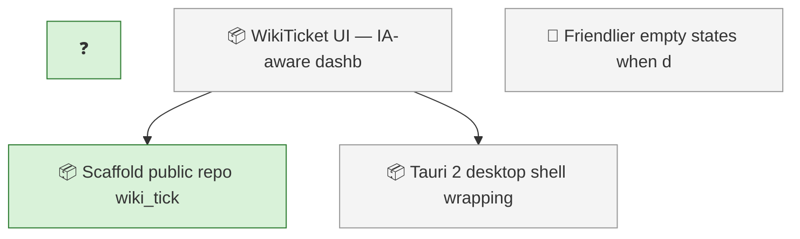
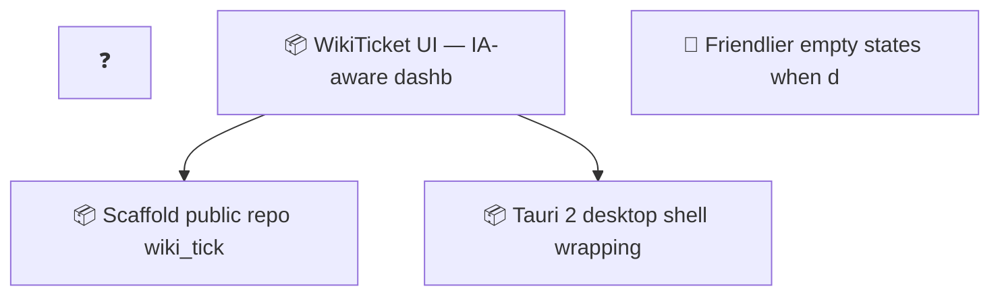

<!-- GENERATED by worklog roadmap-render. DO NOT EDIT. -->

> This file is generated from `.work/todo.jsonl`. Edits will be overwritten.
> To change the roadmap, change the work items: `worklog add|update|close`.

# Roadmap

_1 epic(s) in flight, 4 open item(s), 0 blocked, 0 unclassified._

## Now

### WikiTicket UI — IA-aware dashboard (supersedes wiki-ticket-ui)  ·  P1  ·  6 of 8 done
Local read-only dashboard app visualizing any worklog repo: board, roadmap, activity, releases, docs, publish plane, sync health, charts, and an interactive traceability graph. Consumes the committed docs/.index plane (inventory, graph, publish manifest) instead of deriving document metadata itself. Tracking moved from wiki_ticket_sdd (epic #113) to this repo on 2026-07-22.

| # | Item | Type | Priority | Status | Blocked by |
|---|---|---|---|---|---|
| [2](https://github.com/SpillwaveSolutions/wiki_ticket_sdd_ui/issues/2) | Scaffold public repo wiki_ticket_sdd_ui: README, LICENSE, npm workspaces, CI | task | P2 | in progress | — |

### (no epic)

| # | Item | Type | Priority | Status | Blocked by |
|---|---|---|---|---|---|
| 01KY5ZZX |  |  | — | in progress | — |

## Next

_Nothing here._

## Later

### WikiTicket UI — IA-aware dashboard (supersedes wiki-ticket-ui)  ·  P1  ·  6 of 8 done
Local read-only dashboard app visualizing any worklog repo: board, roadmap, activity, releases, docs, publish plane, sync health, charts, and an interactive traceability graph. Consumes the committed docs/.index plane (inventory, graph, publish manifest) instead of deriving document metadata itself. Tracking moved from wiki_ticket_sdd (epic #113) to this repo on 2026-07-22.

| # | Item | Type | Priority | Status | Blocked by |
|---|---|---|---|---|---|
| [9](https://github.com/SpillwaveSolutions/wiki_ticket_sdd_ui/issues/9) | Tauri 2 desktop shell wrapping the same frontend | task | P3 | todo | — |

### (no epic)

| # | Item | Type | Priority | Status | Blocked by |
|---|---|---|---|---|---|
| 01KY67KX | Friendlier empty states when docs/.index is absent: Docs/Traceability show raw 'not found' error banner — suggest 'run worklog ia-index' guidance instead | task | P3 | todo | — |

## Needs attention

- Orphan events for `01KY5ZZX` — no create/snapshot yet.

## Visual roadmap

### Dependency graph

### Hierarchy

