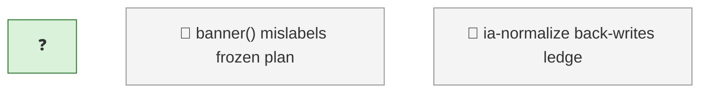

<!-- GENERATED by worklog roadmap-render. DO NOT EDIT. -->

> This file is generated from `.work/todo.jsonl`. Edits will be overwritten.
> To change the roadmap, change the work items: `worklog add|update|close`.

# Roadmap

_0 epic(s) in flight, 3 open item(s), 0 blocked, 0 unclassified._

## Now

### (no epic)

| # | Item | Type | Priority | Status | Blocked by |
|---|---|---|---|---|---|
| 01KY5ZZX |  |  | — | in progress | — |

## Next

_Nothing here._

## Later

### (no epic)

| # | Item | Type | Priority | Status | Blocked by |
|---|---|---|---|---|---|
| 15 | banner() mislabels frozen plan docs as 'status report' — doc_type not checked in ia_render.py's current+frozen branch | task | P3 | todo | — |
| 16 | ia-normalize back-writes ledger refs into doc sidecars after wiki-publish, re-staling the inventory it just wrote | task | P3 | todo | — |

## Needs attention

- Orphan events for `01KY5ZZX` — no create/snapshot yet.

## Visual roadmap

### Dependency graph

### Hierarchy

