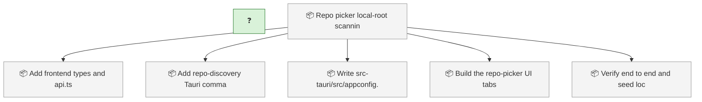
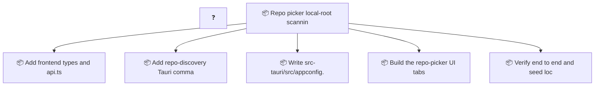

<!-- GENERATED by worklog roadmap-render. DO NOT EDIT. -->

> This file is generated from `.work/todo.jsonl`. Edits will be overwritten.
> To change the roadmap, change the work items: `worklog add|update|close`.

# Roadmap

_1 epic(s) in flight, 6 open item(s), 0 blocked, 0 unclassified._

## Now

### (no epic)

| # | Item | Type | Priority | Status | Blocked by |
|---|---|---|---|---|---|
| 01KY5ZZX |  |  | — | in progress | — |

## Next

### Repo picker: local-root scanning + GitHub org search + shallow-clone cache  ·  P1  ·  0 of 5 done
Add repo discovery to the desktop app's Repo picker: scan configured local root directories for existing worklog-enabled checkouts, and search GitHub by org (via gh) with progressive worklog-enabled filtering and one-click shallow-clone into a managed cache. Currently the picker is folder-dialog-only and requires you to already know the exact local path of an already-cloned repo.

| # | Item | Type | Priority | Status | Blocked by |
|---|---|---|---|---|---|
| 01KYJYCF | Add frontend types and api.ts methods for the new commands | task | P2 | todo | — |
| 01KYJYCF | Add repo-discovery Tauri commands and register them | task | P2 | todo | — |
| 01KYJYCF | Write src-tauri/src/appconfig.rs | task | P2 | todo | — |
| 01KYJYCF | Build the repo-picker UI: tabs, local-roots panel, GitHub search panel | task | P2 | todo | — |
| 01KYJYCF | Verify end to end and seed local config | task | P2 | todo | — |

## Later

_Nothing here._

## Needs attention

- Orphan events for `01KY5ZZX` — no create/snapshot yet.

## Visual roadmap

### Dependency graph

### Hierarchy

