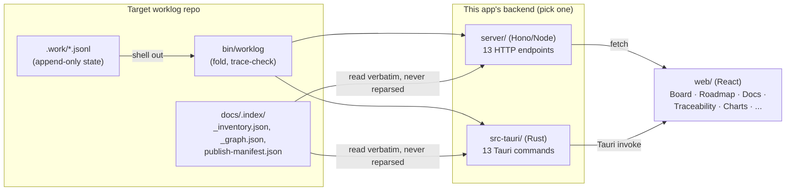

# How this codebase maps to "graph engineering"

"Graph engineering" is informal, emerging terminology from the AI agent community in
2026 — not a formal standard. The most-cited starting point is a one-line post from
developer Peter Steinberger asking whether agent work had "shifted from loops to
graphs," expanded into a fuller account by Carlos E. Perez, and written up since as
practical guides by AI Builder Club ("Graph Engineering Guide 2026"), Flowtivity,
Eigent.ai, and production-architecture research from Zylos.ai. Their rough consensus:
most of what's called "graph engineering" is a shared name for patterns that already
existed (GraphRAG, LangGraph-style multi-agent orchestration, code/knowledge graphs) —
nodes that do work, typed edges that route and carry data, a state layer that's
checkpointed between steps, and an index/router that decides what happens next. The
term is genuinely useful shorthand, not a brand-new technique, and several of the
sources above say so explicitly.

This document isn't a claim that WikiTicket SDD is "the" reference implementation of
that pattern. It's a description of where this codebase's actual design — built before
"graph engineering" was a phrase anyone was using — happens to line up with it, and
where it doesn't.

## The five primitives, mapped to what actually exists

Every row below traces to a real file or mechanism, not an aspirational claim.

| Primitive | What it maps to here |
|---|---|
| **Nodes** | Worklog items (epic/story/task/subtask), each ULID-identified and hierarchical (`parent` field, folded by the target repo's `bin/fold.py`). Plans, releases, ADRs, docs, tickets, and PRs are also nodes in the traceability graph below them. |
| **Typed edges** | `docs/.index/_graph.json` — a generated, deterministic graph with typed edges (`produces`, `belongs-to`, `targets`, `references`, `lands-in`, `supersedes`, `snapshot-of`, `relates-to`) connecting plans ↔ items ↔ tickets ↔ PRs ↔ releases ↔ ADRs. Plus item-level edges (`parent`, `discovered_during`, `supersedes`/`superseded_by`) carried directly in the flat event log. |
| **Index** | `docs/.index/_inventory.json` + `_graph.json` + `publish-manifest.json` — a generated, byte-deterministic reader plane over every document's identity, type, and truth state. This app never re-derives it; it reads the target repo's committed copy directly. |
| **Router** | `bin/worklog`'s subcommand dispatch, the four-axis taxonomy (level × kind × priority × milestone) that classifies a unit of work before it's routed anywhere, and `sync_dispatch.py`'s per-ticketing-system adapter routing. In this repo specifically, `web/src/lib/api.ts` is a small router of its own — the same 13 calls dispatch to either `fetch()` (browser/Node server) or Tauri's `invoke()` (desktop), decided by one `isTauri()` check. |
| **State** | `.work/todo.jsonl` / `.work/done.jsonl` — append-only, replayed deterministically via `worklog fold` into current state. This is a stricter instance of the "state" primitive than most agent frameworks implement: git-native, byte-deterministic, and fully auditable from the raw log. |

**This repo's actual role** is the graph-traversal and inspection surface: the
Traceability panel renders `_graph.json` as an interactive, bidirectional explorer —
pick any node and walk its evidence chain in either direction — which is close to
exactly the "agents and humans traverse the graph" pattern the sources above describe,
just built for human inspection rather than agent context assembly.

## Data flow

Both backends read the same target-repo state and never write to it (the read-only
guarantee documented in `CLAUDE.md`); the frontend doesn't know or care which one it's
talking to.

## Related work

- Peter Steinberger's original framing, expanded by Carlos E. Perez — the spark for the
  "loops → graphs" framing circulating on X in 2026.
- AI Builder Club, "Graph Engineering Guide (2026)" — the most explicit about scoping
  the claim: the underlying technology is largely LangGraph/GraphFlow/ADK; what's new
  is a shared name and the sense that node/edge/state design is a distinct, teachable
  skill.
- Flowtivity, "From Loops to Graphs" — frames graph engineering as GraphRAG plus agent
  memory graphs plus multi-agent orchestration graphs, treating GraphRAG as one part of
  a larger pattern.
- Eigent.ai, "Graph Engineering for AI Agents" — a control-theory framing: designing
  networks of feedback loops (metrics, evals, policies) so they check each other instead
  of drifting independently.
- Zylos.ai research on graph-based agent workflow orchestration in production — treats
  the stateful directed graph (typed nodes, conditional edges, checkpoints,
  observability) as the converged-on production pattern for agent control flow in 2026.

## Possible future directions

None of these are planned work — they're ideas this mapping surfaces, grounded in what
already exists here:

1. **Expose graph traversal as data, not just UI.** The Traceability panel's evidence-chain
   walk is currently a UI-only feature. A `worklog trace <node>` command (or a 14th
   endpoint) returning the same traversal as structured data would let an agent consume
   it directly instead of needing a human to read the panel.
2. **Richer Traceability filters.** Filter the existing graph explorer by edge type or
   `doc_type` — useful once a target repo's graph gets large enough that "walk everything"
   stops being the fastest way to find what changed.
3. **Formalize the dual-transport pattern.** This session's Tauri work implemented the
   same 13-endpoint contract twice (Hono routes, Tauri commands) against one shape,
   verified by a shared fixture. That's a graph-API contract in practice already —
   writing it down explicitly (request/response shapes, error semantics) would make a
   third transport (or a stricter parity test) cheaper to add later.
