# WikiTicket UI Wireframes

PlantUML Salt wireframes for every screen. Salt draws **structure only**
(element inventory, containment, reading order) — not colour, density, or
pixel spacing. Sources live in `docs/ui/wireframes/*.puml` and regenerate with
`npm run wireframes`.

> **Acceptable differences:** monochrome boxes vs dark glass UI; schematic
> spacing; badges as text; desktop-only repo controls appear only on the
> repo-picker frame.

## Index

| Screen | Route | Wireframe |
|--------|-------|-----------|
| [App shell](#app-shell) | chrome | `shell-app` |
| [Overview](#overview) | `/` | `overview` |
| [Board](#board) | `/board` | `board` |
| [Roadmap](#roadmap) | `/roadmap` | `roadmap` |
| [Activity](#activity) | `/activity` | `activity` |
| [Releases](#releases) | `/releases` | `releases` |
| [Docs](#docs) | `/docs` | `docs` |
| [Publish plane](#publish-plane) | `/publish-plane` | `publish-plane` |
| [Sync health](#sync-health) | `/sync-health` | `sync-health` |
| [Charts](#charts) | `/charts` | `charts` |
| [Traceability](#traceability) | `/traceability` | `traceability` |
| [Repo picker](#repo-picker) | modal | `repo-picker` |

Protocol and regenerate commands: also in-repo at `docs/ui/README.md`.

---

## App shell

Shared TopBar (brand, repo chip, branch/tag/drift, **Repo** button) and SideNav
(ten panel links). Every panel reuses this chrome.

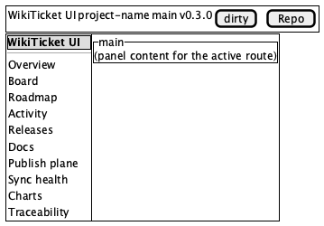

---

## Overview

Stat cards (open / in progress / blocked / epics / latest release / last status),
milestone progress bars, 30-day activity sparkline.

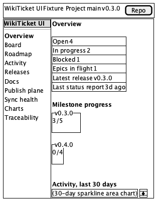

---

## Board

Four columns: Todo · In progress · Blocked · Recently done. Cards show title +
badges; click opens detail drawer with event history.

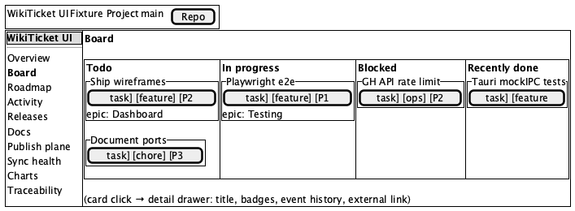

---

## Roadmap

`docs/roadmap.md` — H2 table of contents, GFM body, Mermaid blocks.

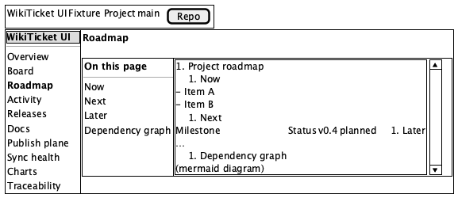

---

## Activity

Merged feed of worklog events, git commits, and GitHub releases with source
filters and optional worklog-op filter.

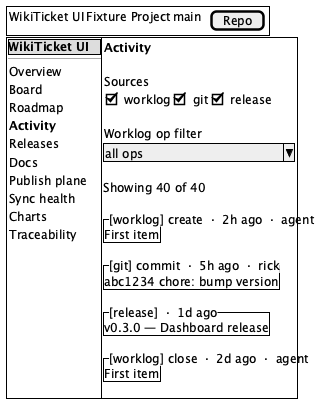

---

## Releases

GitHub release timeline with linked roadmap snapshots; offline empty state when
`gh`/API unavailable.

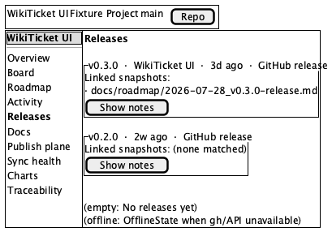

---

## Docs

Inventory list (truth-state badges, search, filter) + markdown content pane.

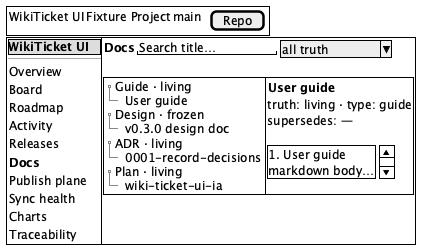

---

## Publish plane

Three-way wiki drift: in-sync · pending republish · source-drift · unknown,
from `.work/published.json` + publish-manifest.

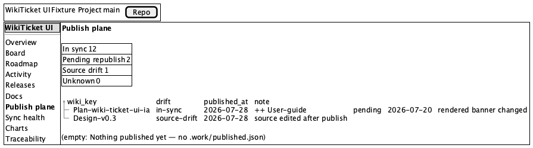

---

## Sync health

Attention banner for orphans/conflicts, open/linked/unpushed stats, sync
cursors, unpushed open items table.

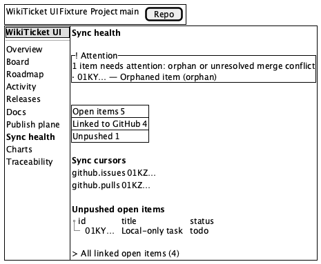

---

## Charts

2×2 grid: burnup, kind mix, weekly velocity, unplanned ratio.

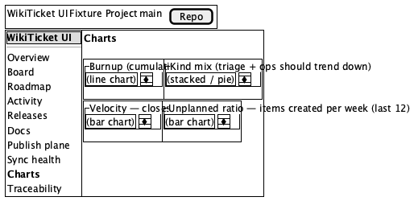

---

## Traceability

Node list + search, focus neighborhood (2 hops upstream/downstream), edge-type
filters, breadcrumb trail, trace-check checklist.

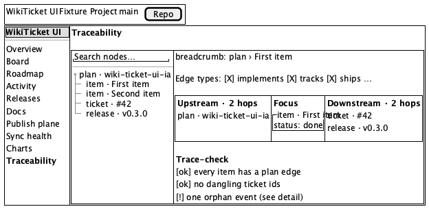

---

## Repo picker

Modal from TopBar **Repo**. Web mode: recent path memory only (no live switch).
Desktop (Tauri): Choose folder… plus Recent / Local / GitHub tabs.

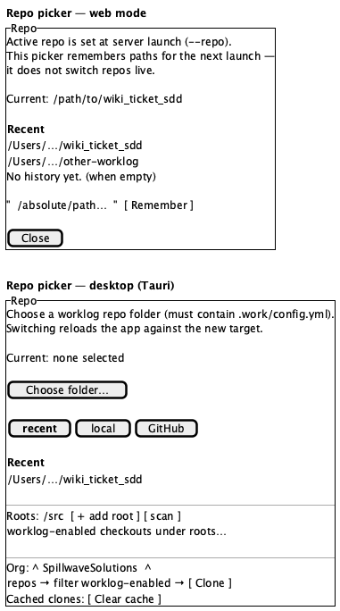

---

## Regenerating

```bash
npm run wireframes         # plantuml → PNG next to .puml and under docs/images/wireframes/
npm run wireframes:check   # syntax only
```
